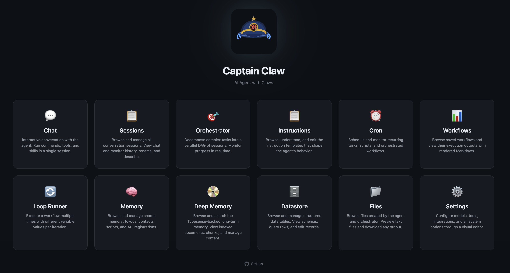

# Captain Claw

[](https://www.python.org/)
[](LICENSE)
[](#quick-start)
[](#feature-snapshot)
[](#guards)



[](https://asciinema.org/a/R1UPSHi4Y6UrOnpY)

[](https://www.youtube.com/watch?v=4g_aA_WnEaw)

An open-source AI agent that runs locally, supports multiple LLM providers, and gets work done — coding, research, automation, document processing, orchestration — through persistent sessions with built-in safety guards.

## Feature Snapshot

| Capability | What it does |
|---|---|
| Multi-model routing | Mix GPT, Claude, Gemini, Ollama, and OpenRouter in one CLI |
| Per-session model selection | Keep one session on Claude, another on GPT, another on Ollama |
| Persistent multi-session workflows | Resume any session exactly where you left off |
| Built-in safety guards | Input, output, and script/tool checks before anything runs |
| 31 built-in tools | Shell, files, web fetch/get/search, docs, email, TTS, STT, image gen/OCR/vision, screen capture + voice commands, desktop automation, Google Workspace CLI (gws — Drive, Docs, Calendar, Gmail), todo, contacts, scripts, APIs, datastore, deep memory, playbooks, personality, BotPort, Flight Deck fleet discovery, Termux (Android) |
| Personality system | Dual-profile system — global agent identity plus per-user profiles for tailored responses |
| Self-reflection | Periodic self-assessment — reviews recent interactions, memory, and tasks to generate improvement directives injected into the system prompt |
| Insights | Persistent knowledge base auto-extracted from conversations — facts, contacts, decisions, deadlines — with FTS search, dedup, and context injection |
| Nervous system | Autonomous "dreaming" layer that cross-references all memory types to discover patterns, connections, and hypotheses — with confidence decay, validation, session bleeding, idle dreaming, tension tracking, maturation pipeline, and cognitive tempo detection |
| Brain Graph | 3D force-directed visualization of the cognitive topology — insights, intuitions, tasks, contacts, sessions, and their connections rendered as an interactive WebGL graph with live WebSocket updates |
| Process of Thoughts | Full lineage tracking across cognitive subsystems — every message, insight, intuition, task, and todo is connected via provenance IDs enabling traversal of the entire thought process |
| Skills system | OpenClaw-compatible skills with auto-discovery and GitHub install |
| Orchestrator / DAG mode | Decompose complex tasks into parallel multi-session execution |
| Memory / RAG | Hybrid vector + text retrieval across workspace and sessions |
| Computer | Retro-themed research workspace — themed visual generation, exploration trees, multi-model selector, folder browser (local + Google Drive), file attachments (images, PDF, DOCX, XLSX, PPTX, MD, TXT, CSV), PDF export via WeasyPrint, persona selector, suggested next-step buttons, 14 built-in themes + custom theme engine, public mode with session isolation and BYOK (Bring Your Own Key) |
| Web UI | Chat, Computer, monitor pane, instruction editor, command palette, persona selector, datastore browser, deep memory dashboard, insights browser, nervous system browser, Brain Graph 3D visualization, reflections dashboard, personality editor, LLM usage analytics |
| Live instructions (`/btw`) | Inject additional instructions while a task is running — works in Chat, Computer, and Telegram |
| Prompt caching | Anthropic prompt caching with automatic cache breakpoints — reduces token costs by up to 90% on cache hits |
| BotPort (agent-to-agent) | Route tasks to specialist agents across a network of Captain Claw instances |
| BotPort Swarm | DAG-based multi-agent orchestration — decompose complex tasks, route to specialist agents, approval gates, retry policies, checkpoints, file transfer, cron scheduling, and a visual dashboard |
| Remote integrations | Telegram (per-user sessions), Slack, Discord with secure pairing |
| Cross-session to-do memory | Persistent task list shared across sessions with auto-capture |
| Cross-session script memory | Persistent script/file tracking with auto-capture from write tool |
| Cross-session API memory | Persistent API endpoint tracking with auto-capture from web_fetch |
| Cross-session playbook memory | Rate sessions to auto-distill reusable orchestration patterns (do/don't pseudo-code) with auto-injection |
| Flight Deck | Multi-agent management dashboard — spawn Docker or pip process agents, fleet discovery and agent-to-agent communication, chat with multiple agents, transfer files and context, Director panel, operations analytics, agent pipelines, three card view modes (expanded/compact/icon), pinned messages, shared clipboard, notifications, keyboard shortcuts, dark/light theme |
| Datastore | SQLite-backed relational tables managed by the agent, with protection rules, import/export, web dashboard, and table export via UI |
| Chunked processing pipeline | Run small-context models (20k–32k tokens) on large content via automatic content chunking |
| Cron scheduling | Interval, daily, and weekly tasks inside the runtime |
| OpenAI-compatible API | `POST /v1/chat/completions` proxy with agent pool |

## Quick Start

### 1. Install

Requires **Python 3.11** or higher.

```bash
python -m venv venv
source venv/bin/activate
pip install captain-claw
```

**Optional extras:**

```bash
pip install captain-claw[tts]      # Local text-to-speech (pocket-tts, requires PyTorch)
pip install captain-claw[vector]   # Vector memory / RAG (numpy, scikit-learn)
pip install captain-claw[vision]   # Image resize before LLM calls (Pillow; or use ImageMagick)
pip install captain-claw[screen]   # Screen capture + voice commands (mss, pynput, sounddevice, soniox)
```

### 2. Set an API key

```bash
export OPENAI_API_KEY="your-openai-key"
export ANTHROPIC_API_KEY="your-anthropic-key"
export GOOGLE_API_KEY="your-google-key"
export GEMINI_API_KEY="your-gemini-key"
export OPENROUTER_API_KEY="your-openrouter-key"
```

Use only the keys you need. For Ollama, no key is required — just set `provider: ollama` in `config.yaml`. For OpenRouter, set `provider: openrouter` and provide your OpenRouter API key.

### 3. Launch

```bash
captain-claw-web          # Web UI (default: http://127.0.0.1:23080)
captain-claw              # Interactive terminal
captain-claw --tui        # Terminal UI
captain-claw --port 8080  # Override web server port
captain-claw-fd           # Flight Deck multi-agent dashboard (default: http://0.0.0.0:25080)
botport                   # BotPort agent-to-agent routing hub
```

First run starts interactive onboarding automatically — it pre-configures 12 models across OpenAI, Anthropic, and Gemini (including image generation, OCR, and vision). The web UI redirects to `/onboarding` on first launch too. To re-run it later: `captain-claw --onboarding`.

If the configured port is busy, Captain Claw automatically tries the next available port (up to 10 attempts).

### 4. Try it

```text
> Investigate failing integration tests and propose a fix.

/models                          # see available models
/session model claude-sonnet     # switch this session to Claude

/new release-notes               # create a second session
/session model chatgpt-fast      # use GPT for this one

> Draft release notes from the previous session updates.

/session run #1 summarize current blockers   # run a prompt in session #1
```

Each session keeps its own model, context, and history.

### 5. Open the Web UI

Run `captain-claw-web` to start the web UI at **http://127.0.0.1:23080**. Use `Ctrl+K` for the command palette, `Ctrl+B` for the sidebar, and edit instruction files live in the Instructions tab.

For the terminal, use `captain-claw` (interactive) or `captain-claw --tui` (TUI mode).

## Docker

### Pull and run (quickest)

```bash
docker pull kstevica/captain-claw:latest
docker pull kstevica/captain-claw-botport:latest
```

You need a `config.yaml` and `.env` in the current directory. Both files **must exist before running** — if they don't, Docker creates empty directories instead and the container fails to start.

**Minimal `.env`** — add only the keys you need:

```bash
# At least one model API key is required
OPENAI_API_KEY="sk-..."
ANTHROPIC_API_KEY="sk-ant-..."
GOOGLE_API_KEY="AI..."
GEMINI_API_KEY="AI..."

# Ollama (if using local models from within Docker)
OLLAMA_BASE_URL="http://host.docker.internal:11434"
```

**Minimal `config.yaml`** — a working starting point:

```yaml
model:
  provider: gemini              # openai, anthropic, gemini, ollama
  model: gemini-2.5-flash       # model name for the chosen provider
  temperature: 0.7
  allowed:
    - id: claude-sonnet
      provider: anthropic
      model: claude-sonnet-4-20250514
    - id: gpt-4o
      provider: openai
      model: gpt-4o

web:
  enabled: true
  port: 23080
```

The first launch starts onboarding automatically and pre-configures models. For the full configuration reference, see [USAGE.md](USAGE.md#configuration-reference).

```bash
# Captain Claw web UI
docker run -d -p 23080:23080 \
  -v $(pwd)/config.yaml:/app/config.yaml:ro \
  -v $(pwd)/.env:/app/.env:ro \
  -v $(pwd)/docker-data/home-config:/root/.captain-claw \
  -v $(pwd)/docker-data/workspace:/data/workspace \
  -v $(pwd)/docker-data/sessions:/data/sessions \
  -v $(pwd)/docker-data/skills:/data/skills \
  kstevica/captain-claw:latest

# BotPort (optional, for multi-agent routing)
docker run -d -p 33080:33080 \
  -v $(pwd)/botport/config.yaml:/app/config.yaml:ro \
  -v $(pwd)/.env:/app/.env:ro \
  kstevica/captain-claw-botport:latest
```

- **Web UI:** http://localhost:23080
- **BotPort dashboard:** http://localhost:33080

### Build from source with Docker Compose

If you cloned the repo, use the included `docker-compose.yml`:

```bash
docker compose up -d                # both services
docker compose up -d captain-claw   # web UI only
docker compose up -d botport        # BotPort only
```

### Persistent data

All persistent data is stored under `./docker-data/` on the host:

| Host path | Container path | Contents |
|---|---|---|
| `./docker-data/home-config/` | `/root/.captain-claw/` | Settings saved from the web UI |
| `./docker-data/workspace/` | `/data/workspace/` | Workspace files |
| `./docker-data/sessions/` | `/data/sessions/` | Session database |
| `./docker-data/skills/` | `/data/skills/` | Installed skills |

Configuration (`config.yaml`) and secrets (`.env`) are mounted read-only from the current directory.

### Build and manage

```bash
docker compose up -d --build    # rebuild after code changes
docker compose logs -f          # follow logs
docker compose down             # stop all services
```

See [USAGE.md](USAGE.md#docker) for the full Docker reference.

## How It Works

### Sessions

Sessions are first-class. Create named sessions for separate projects, switch instantly, and persist everything.

```text
/new incident-hotfix
/session model claude-sonnet
/session protect on                            # prevent accidental /clear
/session procreate #1 #2 "merged context"      # merge two sessions
/session run #2 summarize current blockers     # run prompt in another session
/session export all                            # export chat + monitor history
/nuke                                          # wipe everything (files, memory, insights, intuitions, sessions) and start fresh
```

### Tools

Captain Claw ships with 31 built-in tools. The agent picks the right tool for each task automatically.

| Tool | What it does |
|---|---|
| `shell` | Execute terminal commands |
| `read` / `write` / `glob` | File operations and pattern matching |
| `web_fetch` | Fetch and extract readable text from web pages (always text mode) |
| `web_get` | Fetch raw HTML source for scraping and DOM inspection |
| `web_search` | Search the web via Brave Search API |
| `pdf_extract` | Extract PDF content to markdown |
| `docx_extract` | Extract Word documents to markdown |
| `xlsx_extract` | Extract Excel sheets to markdown tables |
| `pptx_extract` | Extract PowerPoint slides to markdown |
| `image_gen` | Generate images from text prompts (DALL-E 3, gpt-image-1) |
| `image_ocr` | Extract text from images via vision-capable LLMs |
| `image_vision` | Analyze and describe images via vision-capable LLMs |
| `pocket_tts` | Generate speech audio (MP3) locally with 8 built-in voices |
| `stt` | Speech-to-text transcription (Soniox realtime, OpenAI Whisper, Gemini) |
| `send_mail` | Send email via SMTP, Mailgun, or SendGrid |
| `gws` | Google Workspace CLI — Drive, Docs, Sheets, Slides, Gmail (read), and Calendar via the `gws` binary |
| `todo` | Persistent cross-session to-do list with auto-capture |
| `contacts` | Persistent cross-session address book with auto-capture |
| `scripts` | Persistent cross-session script/file memory with auto-capture |
| `apis` | Persistent cross-session API memory with auto-capture |
| `datastore` | Manage relational data tables with CRUD, import/export, raw SQL, and protection rules |
| `personality` | Read or update the agent personality and per-user profiles |
| `typesense` | Index, search, and manage documents in deep memory (Typesense) |
| `playbooks` | Persistent cross-session orchestration pattern memory with auto-distillation |
| `botport` | Consult specialist agents through the BotPort agent-to-agent network |
| `flight_deck` | Discover and communicate with peer agents in the Flight Deck fleet (list agents, consult peers) |
| `screen_capture` | Capture screenshots and analyze with vision; opt-in global hotkey with voice commands and selected-text detection |
| `desktop_action` | Desktop GUI automation — click, type, scroll, press keys, open apps/URLs; pairs with screen_capture for coordinate-based interaction |
| `termux` | Interact with Android device via Termux API (camera, battery, GPS, torch) |

See [USAGE.md](USAGE.md#tools-reference) for full parameters and configuration.

### Guards

Three built-in guard types protect against risky operations:

```yaml
guards:
  input:
    enabled: true
    level: "ask_for_approval"     # or "stop_suspicious"
  output:
    enabled: true
    level: "stop_suspicious"
  script_tool:
    enabled: true
    level: "ask_for_approval"
```

Guards run before LLM requests (input), after model responses (output), and before any command or tool execution (script_tool). See [USAGE.md](USAGE.md#guard-system) for details.

## Configuration at a Glance

Captain Claw is YAML-driven with environment variable overrides.

```yaml
model:
  provider: "openai"
  model: "gpt-4o-mini"
  allowed:
    - id: "claude-sonnet"
      provider: "anthropic"
      model: "claude-sonnet-4-20250514"

tools:
  enabled: ["shell", "read", "write", "glob", "web_fetch", "web_search",
            "pdf_extract", "docx_extract", "xlsx_extract", "pptx_extract",
            "image_gen", "image_ocr", "image_vision",
            "pocket_tts", "stt", "send_mail", "gws", "todo", "contacts",
            "scripts", "apis", "datastore", "playbooks", "personality",
            "botport", "termux", "screen_capture", "desktop_action"]

web:
  enabled: true
  port: 23080
```

**Load precedence:** `./config.yaml` > `~/.captain-claw/config.yaml` > environment variables > `.env` file > defaults.

For the full configuration reference (23 sections, every field), see [USAGE.md](USAGE.md#configuration-reference).

## Advanced Features

Each of these is documented in detail in [USAGE.md](USAGE.md).

- **[Flight Deck](USAGE.md#flight-deck)** — Multi-agent management dashboard. Spawn and manage Captain Claw agents in Docker containers or as local pip processes (no Docker required), register local/remote agents by host:port, chat with multiple agents simultaneously via WebSocket, browse and transfer files between agents, forward conversation context with tasks to other agents. Agents discover and communicate with peers via the `flight_deck` tool and live fleet API. Includes Director panel with unified agent overview and broadcast, Operations dashboard with per-agent token/cost analytics, agent pipelines for chaining agent outputs automatically, pinned messages, shared clipboard, notification center, keyboard shortcuts, resizable panels, free-form draggable agent cards with three view modes (expanded/compact/icon), file viewer with syntax highlighting, dark/light theme, and embedded chat on agent cards. Run with `captain-claw-fd`.

- **[Computer](USAGE.md#computer)** — A retro-themed research workspace at `/computer`. Three-panel layout with input area, activity log, and tabbed output (Answer, Blueprint, Files, Visual, Map). Features themed HTML visual generation via LLM, interactive exploration trees for multi-turn research, model selector modal, persona selector, token tier control, folder browser (local filesystem + Google Drive), file attachments (images, PDF, DOCX, XLSX, PPTX, MD, TXT, CSV), PDF export via WeasyPrint (preserves full CSS styling), suggested next-step buttons after each response, and 14 built-in themes (Amiga Workbench, Atari ST, C64, Classic Mac, Windows 3.1, Hacker Terminal, and more) plus a custom theme engine. Each theme includes unique boot sequences and CSS variable styling. Supports **public mode** (`web.public_run: "computer"`) with per-session isolation, access codes, route lockdown, and **BYOK (Bring Your Own Key)** — public users can provide their own LLM API credentials (OpenAI, Anthropic, Gemini, xAI, OpenRouter) stored only in the browser.

- **[Orchestrator / DAG mode](USAGE.md#orchestrator--dag-mode)** — `/orchestrate` decomposes a complex request into a task DAG and runs tasks in parallel across separate sessions with real-time progress monitoring. Also available headless via `captain-claw-orchestrate`.

- **[Skills system](USAGE.md#skills-system)** — OpenClaw-compatible `SKILL.md` files. Auto-discovered from workspace, managed, and plugin directories. Install from GitHub with `/skill install <url>`.

- **[Memory / RAG](USAGE.md#memory-and-rag)** — Hybrid vector + text retrieval. Indexes workspace files and session messages. Configurable embedding providers (OpenAI, Ollama, local hash fallback).

- **[Cross-session to-do memory](USAGE.md#todo-commands)** — Persistent task list shared across sessions. Auto-capture from natural language, context injection to nudge the agent, and full `/todo` command support across CLI, Web UI, Telegram, Slack, and Discord.

- **[Cross-session address book](USAGE.md#contacts-commands)** — Persistent contact memory that tracks people across sessions. Auto-captures from conversation and email, auto-computes importance from mention frequency, and injects relevant contact context on demand.

- **[Cross-session script memory](USAGE.md#scripts-commands)** — Persistent tracking of scripts and files the agent creates. Auto-captures from the `write` tool when executable extensions are detected. Stores path + metadata (no file content in DB). On-demand context injection when script names appear in conversation.

- **[Cross-session API memory](USAGE.md#apis-commands)** — Persistent tracking of external APIs the agent interacts with. Auto-captures from `web_fetch` and `web_get` when API-like URLs are detected. Stores credentials, endpoints, and accumulated context. On-demand context injection when API names or URLs appear in conversation.

- **[Cron scheduling](USAGE.md#cron-commands)** — Pseudo-cron within the runtime. Schedule prompts, scripts, or tools at intervals, daily, or weekly. Guards remain active for every cron execution.

- **[Execution queue](USAGE.md#execution-queue-1)** — Five queue modes (steer, followup, collect, interrupt, queue) control how follow-up messages are handled during agent execution.

- **[BotPort (agent-to-agent)](USAGE.md#botport)** — Connect multiple Captain Claw instances through the BotPort routing hub. Agents can delegate tasks to specialist instances based on expertise tags, persona matching, or LLM-powered routing. Supports bidirectional follow-ups, context negotiation, and concern lifecycle management. Included with `pip install captain-claw` — run `botport` to start a hub, then connect instances via WebSocket (e.g. `wss://botport.kstevica.com/ws`).

- **[BotPort Swarm](USAGE.md#botport-swarm)** — DAG-based multi-agent orchestration through BotPort. Decompose complex goals into task graphs with dependencies, route each task to specialist agents (connected or LLM-designed), and execute with configurable concurrency. Features approval gates, retry with backoff and fallback personas, multi-level timeouts (warn → extend → fail), checkpointing with save/restore, inter-agent file transfer (gzip + base64 over WebSocket, up to 50 MB), cron scheduling for recurring swarms, full audit logging, and a visual dashboard with DAG canvas, task monitoring, and file manager. Error policies: fail_fast, continue_on_error, manual_review.

- **[Remote integrations](USAGE.md#remote-integrations)** — Connect Telegram, Slack, or Discord bots. Telegram users get isolated per-user sessions with concurrent agent execution. Unknown users get a pairing token; the operator approves locally with `/approve user`.

- **[OpenAI-compatible API](USAGE.md#openai-compatible-api-proxy)** — `POST /v1/chat/completions` endpoint proxied through the Captain Claw agent pool. Streaming supported.

- **[Google Workspace CLI (gws)](USAGE.md#gws)** — Access Google Drive, Docs, Sheets, Slides, Gmail (read), and Calendar through the `gws` CLI binary. Search and download Drive files, read Google Docs/Sheets/Slides inline (Sheets exported as XLSX with all sheets, Presentations as PPTX with all slides), create Google Docs, list and search emails, view calendar agenda and create events. The scale loop automatically processes Google Drive file lists without manual file-ID handling. Supports a `raw` passthrough mode for any `gws` command. Requires separate `gws` CLI installation and authentication.

- **[Datastore](USAGE.md#datastore)** — SQLite-backed relational data tables managed entirely by the agent. 19 tool actions cover schema management, CRUD operations, raw SELECT queries, CSV/XLSX import and export, and a four-level protection system (table, column, row, cell). Includes a [web dashboard](USAGE.md#datastore-dashboard) for browsing tables, editing rows, running SQL, uploading files, and exporting tables as CSV/XLSX/JSON.

- **[Deep Memory (Typesense)](USAGE.md#deep-memory-typesense)** — Long-term searchable archive backed by Typesense. Indexes processed items from the scale loop, web fetches, and manual input. Hybrid keyword + vector search. Separate from the SQLite-backed semantic memory. Includes a [web dashboard](USAGE.md#deep-memory-dashboard) for browsing, searching, and managing indexed documents.

- **[Playbooks](USAGE.md#cross-session-playbook-memory)** — Persistent cross-session orchestration pattern memory. Rate sessions as good/bad to auto-distill reusable do/don't pseudo-code patterns. Playbooks are auto-injected into planning context when similar tasks are detected, improving decision quality over time. Includes a [web editor](USAGE.md#playbooks-editor) and REST API.

- **[Send mail](USAGE.md#send-mail)** — SMTP, Mailgun, or SendGrid. Supports attachments up to 25 MB.

- **[Termux (Android)](USAGE.md#termux)** — Run Captain Claw on Android via Termux. Take photos with front/back camera (auto-sent to Telegram), get GPS location, check battery status, and toggle the flashlight — all through the Termux API.

- **[Document extraction](USAGE.md#tools-reference)** — PDF, DOCX, XLSX, PPTX converted to markdown for agent consumption.

- **[Chunked processing pipeline](USAGE.md#chunked-processing-pipeline)** — Enables small-context models (20k–32k tokens) to process large content. A context budget guard detects when content exceeds the available window, splits it into sequential chunks, processes each with full instructions, and combines partial results via LLM synthesis or concatenation. Integrates transparently with the scale loop micro-loop.

- **[Context compaction](USAGE.md#context-compaction)** — Auto-compacts long sessions at configurable thresholds. Manual compaction with `/compact`.

- **[Personality system](USAGE.md#personality-system)** — Dual-profile system with a global agent identity (name, background, expertise) and per-user profiles that tailor responses to each user's perspective. Editable via the `personality` tool, REST API, or the Settings page. Telegram users get automatic per-user profiles.

- **[Self-reflection system](USAGE.md#self-reflection-system)** — Periodic self-assessment that reviews recent conversations, memory facts, completed tasks, and the previous reflection to generate actionable improvement directives. The latest reflection is injected into the system prompt, enabling the agent to learn and adapt over time. Auto-triggers after sufficient activity (configurable cooldown), or run on demand with `/reflection generate`. Includes a web UI dashboard at `/reflections` and REST API.

- **[Insights](USAGE.md#insights)** — Persistent knowledge base auto-extracted from conversations. The agent identifies facts, contacts, decisions, deadlines, and other durable knowledge, deduplicates via entity keys and BM25 similarity, and stores them in SQLite with FTS5 search. Relevant insights are automatically injected into the system prompt to inform future conversations. Includes a web browser at `/insights`, REST API, and `/insight` chat commands.

- **[Nervous System](USAGE.md#nervous-system)** — Autonomous "dreaming" layer that proactively synthesizes across all memory types (working, semantic, deep, insights, reflections). Background dream cycles find non-obvious connections, recurring patterns, and speculative hypotheses, storing them as "intuitions" with confidence scores, importance ratings, and source layer tracking. Intuitions decay over time unless validated, bleed across sessions in admin mode, and are surfaced in the agent's context to guide behavior. Includes **idle dreaming** (dreams during inactive hours via the cron scheduler) and **musical cognition** features: unresolved tension tracking (holds contradictions like musical dissonance rather than forcing resolution), a maturation pipeline (new intuitions sit through dream cycles before surfacing), and cognitive tempo detection (adagio/moderato/allegro mode adapts processing depth to conversation rhythm). Configurable via Settings. Includes a web browser at `/intuitions`, REST API, `/intuition` chat commands, and cognitive metrics tracking.

- **[Brain Graph](USAGE.md#brain-graph)** — Interactive 3D force-directed visualization of the agent's cognitive topology at `/brain-graph`. Built on Three.js and 3d-force-graph, it renders insights, intuitions, tasks, briefings, todos, contacts, sessions, messages, and cognitive events as typed 3D nodes with directional edges showing provenance chains. Features include: typed node shapes (spheres, boxes, icosahedrons, tetrahedrons, etc.), dynamic session spheres that auto-size to enclose child nodes, WebSocket live updates when new insights or intuitions are created, node detail panel with prev/next navigation, clickable connections list, full content modal with markdown rendering, search and type filters, focus-on-node deep linking from chat and computer via the brain button, and public mode support.

- **[Process of Thoughts](USAGE.md#process-of-thoughts)** — Full lineage tracking across all cognitive subsystems. Every message gets a unique `message_id`, insights track `source_message_id` and `supersedes_id` for evolution chains, intuitions track `source_message_id` and `resolved_from_id` for tension resolution, todos support `parent_id` for subtask hierarchy and `triggered_by_id` for causal chains. Sister session tasks link back via `source_type` and `source_id`. Together these edges form a traversable thought graph — the "Process of Thoughts" — that traces how a conversation message became an insight, which triggered a dream cycle intuition, which spawned a sister session task, which produced a briefing.

- **[Desktop automation](USAGE.md#desktop-action)** — Cross-platform desktop GUI automation via `pyautogui`. Click, double-click, right-click, type text, press keys, trigger hotkeys, scroll, drag, and open apps/folders/URLs. Pairs with `screen_capture` — capture a screenshot first, identify coordinates, then act on them. Includes a `screenshot_click` action that combines vision-based element detection with clicking. Requires `pip install pyautogui`.

- **[Screen capture + voice commands](USAGE.md#screen-capture)** — Capture screenshots via `/screenshot`, the `screen_capture` tool, or a global hotkey (double-tap Shift, configurable). Hold the key and speak — audio is transcribed in realtime via Soniox (or Whisper/Gemini) and submitted alongside the screenshot. If text is selected in any app, it's captured via the clipboard and used as context instead of a screenshot. Voice instructions trigger an audio response via TTS so the agent speaks back. The global hotkey is opt-in — enable it in **Settings → Voice & Hotkey** (hot-reloads without restart). Install with `pip install captain-claw[screen]`.

- **[Prompt caching](USAGE.md#prompt-caching)** — Automatic Anthropic prompt caching with two cache breakpoints (static system prompt + last conversation message). Cache reads are ~90% cheaper. The static-first prompt layout also benefits OpenAI's automatic prefix caching. All other providers are unaffected.

- **[LLM Usage Dashboard](USAGE.md#llm-usage-dashboard)** — Token usage analytics at `/usage` with period selection, provider/model/BYOK dropdown filters, summary cards (tokens, cache read/created, latency, errors, BYOK calls), and a per-call detail table with BYOK indicators.

- **[Live instructions (`/btw`)](USAGE.md#btw-command)** — Inject additional context or course corrections while the agent is working on a task. Send `/btw <instruction>` or `btw <instruction>` in Chat, Computer, or Telegram. Instructions accumulate and are applied to all remaining subtasks, then cleared when the task completes.

- **[Session export](USAGE.md#session-commands)** — Export chat, monitor, pipeline trace, or pipeline summary to files.

## Development

```bash
pip install -e ".[dev]"
pytest
ruff check captain_claw/
```

### Architecture

| Path | Role |
|---|---|
| `captain_claw/agent.py` | Main orchestration logic |
| `captain_claw/llm/` | Provider abstraction (OpenAI, Anthropic, Gemini, Ollama) |
| `captain_claw/tools/` | Tool registry and 30 tool implementations |
| `captain_claw/personality.py` | Agent and per-user personality profiles |
| `captain_claw/reflections.py` | Self-reflection system with auto-trigger and prompt injection |
| `captain_claw/insights.py` | Persistent insights memory with auto-extraction and FTS5 search |
| `captain_claw/nervous_system.py` | Autonomous dreaming and intuition synthesis across memory layers |
| `captain_claw/cognitive_tempo.py` | Processing depth detection — adagio/moderato/allegro cognitive rhythm |
| `captain_claw/cognitive_metrics.py` | Musical cognition tracking system for tension, maturation, and tempo metrics |
| `captain_claw/web/rest_brain_graph.py` | Brain Graph REST API — aggregates all cognitive data into graph nodes/edges |
| `captain_claw/session/` | SQLite-backed session persistence |
| `captain_claw/skills.py` | Skill discovery, loading, and invocation |
| `captain_claw/session_orchestrator.py` | Parallel multi-session DAG orchestrator |
| `captain_claw/semantic_memory.py` | Hybrid vector + text retrieval (RAG) |
| `captain_claw/datastore.py` | SQLite-backed relational datastore |
| `captain_claw/deep_memory.py` | Typesense-backed long-term archive |
| `captain_claw/botport_client.py` | BotPort WebSocket client |
| `captain_claw/google_oauth_manager.py` | Google OAuth token management |
| `captain_claw/cli.py` | Terminal UI |
| `captain_claw/web/` | Web server (WebSocket + REST + static) |
| `captain_claw/flight_deck/` | Flight Deck — multi-agent management dashboard (FastAPI + React) |
| `captain_claw/orchestrator_cli.py` | Headless orchestrator CLI |
| `captain_claw/agent_chunked_processing_mixin.py` | Chunked processing pipeline for small-context models |
| `captain_claw/config.py` | Configuration and env overrides |
| `captain_claw/instructions/` | Externalized prompt and instruction templates |

## FAQ

**Is Captain Claw only for coding?**
No. It handles coding, ops automation, web research, document processing, email, and multi-session orchestration.

**Can I use local models only?**
Yes. Set provider to `ollama` and run fully local.

**Can I run different models at the same time?**
Yes. Model selection is per session. Different sessions can use different providers and models simultaneously.

**Do I need guards enabled?**
No. Guards are off by default. Enable them when you want stricter safety behavior.

**Is there a web interface?**
Yes — it's the default. Run `captain-claw` and open `http://127.0.0.1:23080`. Same agent, sessions, tools, and guardrails as the terminal. Use `--tui` for the terminal UI.

**Where is the full reference?**
See [USAGE.md](USAGE.md) for comprehensive documentation of every command, tool, config option, and feature.

## Get Started

```bash
python -m venv venv && source venv/bin/activate
pip install captain-claw
captain-claw-web
```

If Captain Claw is useful to you, [give the repo a star](https://github.com/kstevica/captain-claw) to help others find it.

Found a bug or have a feature idea? [Open an issue](https://github.com/kstevica/captain-claw/issues). Contributions welcome.

## License

[MIT](LICENSE)
