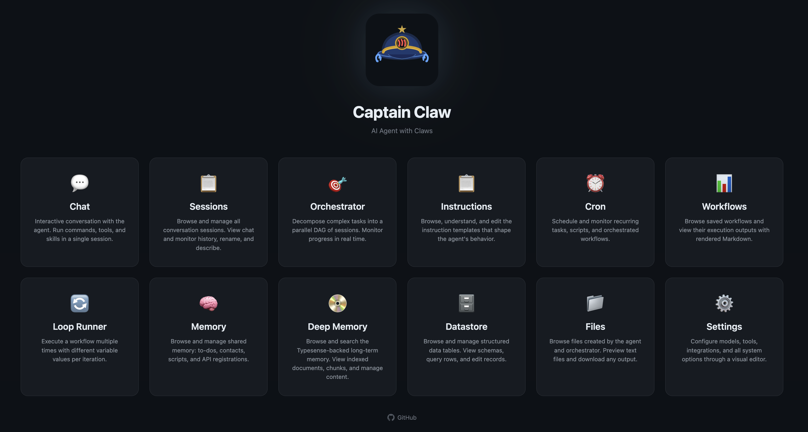

# Captain Claw

[](https://www.python.org/)
[](LICENSE)
[](#quick-start)
[](#multi-model-support)



[](https://asciinema.org/a/R1UPSHi4Y6UrOnpY)

[](https://www.youtube.com/watch?v=4g_aA_WnEaw)

An open-source AI agent with multi-agent orchestration, autonomous cognitive systems, and a full management dashboard. Runs locally, supports every major LLM provider, and ships with 44 built-in tools.

## What's New in 0.4.25

**Plan mode.** Captain Claw can now plan, execute, verify, and self-revise multi-step work end-to-end. A single user request becomes a reviewable DAG of executable steps, runs under the existing orchestrator, and gates each step through per-step acceptance criteria — with bounded auto-revision when verification fails. Plan mode is wired through Flight Deck's chat as a first-class peer to free-form chat.

- **`/plan <request>`** — `PlanGenerator` produces a 3-8 step plan with concrete `description` + measurable `acceptance_criteria` for every step. Persisted as a workflow JSON in `workspace/workflows/`, so it round-trips with the existing workflow tools. Deliverable steps are now required to name their output file (e.g. `saved/tmp/<slug>.md`) so the artefact never gets buried in the run transcript.
- **`/plan-execute`** — `PlanExecutor` runs the plan through the DAG runner, emits live `plan_*` events, and short-circuits the orchestrator's redundant final synthesis pass (`skip_synthesize=True`) — the plan card itself is the deliverable surface.
- **Two-stage verification gate** — `PlanVerifier` runs optional JSON-schema validation first (fast, deterministic), then an LLM judge against `acceptance_criteria`. Failures stop the walk and surface the verifier's notes in the plan card.
- **Bounded auto-revision** — `PlanReviser` rewrites the failing step's description (and optionally tightens its acceptance criteria), and `PlanExecutor` resets the failed step + transitive dependents to PENDING before re-running. Default budget: 2 revisions per step.
- **Orchestrate-kind fan-out** — `step_kind: "orchestrate"` steps are expanded in place via `SessionOrchestrator._decompose`. Sub-tasks run in parallel; the original step becomes an atomic join with the sub-task IDs as deps.
- **Inline plan card in chat** — Live per-step status, verification chips, revision badges with rationale popovers, collapsible long plans, **persisted to `localStorage`** so a Flight Deck refresh mid-plan repaints the card identically.
- **`/planning on` toggle** — A bold violet `ON`/`OFF` pill in the chat composer. With it on, every plain-text message you send is auto-routed through `/plan` + `/plan-execute` — no slash commands needed. The pill mirrors the agent's authoritative state both ways and pulses while a plan runs.
- **Connection resilience** — WebSocket plumbing hardened end-to-end for the long executor + verifier + reviser cycles: agent ⇄ FD `ping_interval=20` keepalive, browser auto-reconnect with exponential backoff, server-side `_send` and receive loop wrapped against `ClientConnectionResetError` so a refresh mid-step doesn't fill the agent log with tracebacks.
- **Research-aware iteration budget** — `_estimate_task_iterations` learned the shape of multi-source research steps (`reputable sources`, `at least N sources`, `web_search`, `each source` patterns); ceiling raised from 25 → 40 so `gather_sources` stops exhausting its budget mid-research.
- **Workflow run transcripts viewable** — `workspace/workflows/` is now in the file-preview allow-list, so the Markdown transcripts auto-saved by `_save_run_output` open from the chat without 403.

Backward compatible — existing 0.4.24 configurations keep working unchanged and plan mode stays opt-in even when the toggle is off. See `RELEASE_NOTES_0.4.25.md` for the full per-step breakdown.

See [RELEASE_NOTES.md](RELEASE_NOTES.md) for the full changelog.

## What Makes Captain Claw Different

### Flight Deck — Multi-Agent Command Center

A full management dashboard for running teams of AI agents. Spawn, monitor, configure, and coordinate agents from a single UI.

```bash
captain-claw-fd    # http://0.0.0.0:25080
```

- **Agent Forge** — Describe a business goal in plain text. An LLM designs a specialized team with roles, tools, operating procedures, and a lead coordinator. Review, customize, and spawn the entire team in one click.
- **Agent Council** — Structured multi-agent deliberation. Run brainstorms, debates, reviews, or planning sessions with 2-N agents. Each agent self-scores suitability, chooses actions (answer, challenge, refine, broaden), and responds in moderated rounds. A moderator synthesizes conclusions; all agents vote. Export as markdown minutes.
- **Fleet Communication** — Agents discover peers automatically. Consult (synchronous ask) or delegate (asynchronous queue) tasks to specialist agents. Shared workspace and file transfer across the fleet.
- **Director Panel** — Unified overview of all agents. Broadcast messages fleet-wide. Per-agent token/cost analytics, trace timelines, datastore browser, file browser, config editor.
- **Multi-user Auth** — JWT authentication, admin dashboard, rate limiting, and quotas.
- **MCP Connections** — Add Model Context Protocol servers (HTTP or stdio) once and every entitled agent in the fleet picks up their tools — no per-agent config. Phase 2 adds stdio transport for `npx`/`uvx`-shipped servers, per-agent allowlists, hot tool-list reload over SSE, and streaming tool calls.

### Cognitive Architecture

Captain Claw has a five-layer memory system and autonomous cognitive processes that run without user intervention.

**Memory Layers:**

| Layer | What it stores | How it's used |
|---|---|---|
| Working Memory | Current conversation in the LLM context window | Immediate reasoning |
| Semantic Memory | Hybrid vector + BM25 full-text search over documents and sessions | Auto-injected when relevant to the current query |
| Deep Memory | Typesense-backed long-term archive, scales to millions of documents | Searched on demand for deep recall |
| Insights | Auto-extracted facts, contacts, decisions, and deadlines (SQLite + FTS5) | Cross-session knowledge injected into system prompt |
| Nervous System | Autonomous "intuitions" — patterns, hypotheses, and connections | Surfaces non-obvious findings the agent wouldn't otherwise notice |

**Autonomous Processes:**

- **Dreaming** — Background dream cycles cross-reference all memory layers to synthesize intuitions. Runs after every N messages and during idle hours. Intuitions have confidence scores that decay over time unless validated.
- **Tension Tracking** — Holds unresolved contradictions (like musical dissonance) rather than forcing premature resolution. Tensions persist until evidence resolves them.
- **Maturation Pipeline** — New intuitions sit through multiple dream cycles before being surfaced to the agent, reducing noise.
- **Cognitive Tempo** — Detects whether the user is in deep contemplative mode or rapid task execution, and adapts processing depth accordingly (adagio / moderato / allegro).
- **Cognitive Modes** — Seven tunable behavioral profiles (Ionian through Locrian, inspired by musical scales) that shift the agent between analytical, creative, cautious, and exploratory approaches.
- **Self-Reflection** — Periodic self-assessment that reviews conversations, memory, and completed tasks to generate improvement directives injected into the system prompt.
- **Insights Extraction** — Automatically identifies durable knowledge from conversations — deduplicates, categorizes, and stores for future context injection.

**Visualization:**

- **Brain Graph** — Interactive 3D force-directed graph of the entire cognitive topology. Insights, intuitions, tasks, contacts, and sessions rendered as typed nodes with provenance edges. Live WebSocket updates.
- **Process of Thoughts** — Full lineage tracking across all cognitive subsystems. Every message, insight, intuition, and task is connected via provenance IDs, forming a traversable thought graph.

### Orchestrator / DAG Mode

Decompose complex tasks into a dependency graph and execute subtasks in parallel across separate agent sessions.

```
/orchestrate Research startups in 3 countries, analyze founders, create comparison spreadsheet
```

- LLM decomposes the prompt into a task DAG with dependencies
- Parallel execution with configurable worker count
- Shared workspace for inter-task data flow
- Structured output validation (JSON Schema with auto-retry)
- Real-time trace timeline (Gantt-style visualization)
- Headless CLI mode for cron/scripts: `captain-claw-orchestrate`

### BotPort — Agent-to-Agent Network

Connect multiple Captain Claw instances through a routing hub. Agents delegate tasks to specialists based on expertise tags, persona matching, or LLM-powered routing.

- **BotPort Swarm** — DAG-based multi-agent orchestration across networked instances. Approval gates, retry with fallback, checkpointing, inter-agent file transfer (up to 50 MB), cron scheduling, and a visual dashboard.

### MCP Server (act as an MCP server)

Captain Claw runs as a Model Context Protocol server over stdio — Claude Desktop and other MCP clients can browse sessions, read conversation history, and send prompts to the full agent.

```bash
captain-claw-mcp    # stdio, configure in claude_desktop_config.json
```

### MCP Client (consume MCP servers via Flight Deck)

The other direction: agents in your fleet call into MCP servers. Add a server once in **Flight Deck → Connections → MCP servers** and every agent the allowlist permits gets the tools auto-registered on boot.

- **HTTP transport** — Streamable-HTTP MCP servers, with optional OAuth2 `client_credentials`, captured `Mcp-Session-Id`, and SSE-response parsing.
- **stdio transport** — `command` + `args` + `env` for local MCP servers shipped via `npx` / `uvx` (filesystem, sqlite, github, postgres, etc.). Children are spawned lazily, auto-respawned on death, and torn down with SIGTERM/SIGKILL on close.
- **Per-agent allowlists** — Restrict each server to specific agent slugs. Disallowed agents get HTTP 404 (existence is opaque).
- **Hot reload** — Agents subscribe to `/fd/mcp/agent/events` (SSE) and re-register proxy tools the moment you change a server — no restart needed.
- **Streaming calls** — `POST /fd/mcp/<name>/call_stream` emits `progress` / `result` / `error` SSE frames for UIs that want live indicators while a long-running tool runs.

See **USAGE.md → Flight Deck → Connections → MCP servers** for the full endpoint reference and config schema.

### Safety Guards

Three layers of protection that run before, during, and after agent operations:

- **Input guards** — Validate user intent before the LLM sees it
- **Script guards** — AST-level analysis of generated code before execution
- **Output guards** — Validate tool results for hallucinations and safety

Guards support two modes: `stop_suspicious` (block automatically) or `ask_for_approval` (prompt the user).

## Multi-Model Support

Mix providers freely — each session independently selects its model.

| Provider | Models |
|---|---|
| OpenAI (API key) | GPT-5.4, GPT-5.4-mini, GPT-5.4-nano, o3, o4-mini, gpt-image-1.5 |
| OpenAI (Sign in with ChatGPT) | `gpt-5`, `gpt-5-codex`, `gpt-5.1-codex`, `gpt-5.1-codex-mini`, `gpt-5.1-codex-max`, `gpt-5.2-codex`, `gpt-5.3-codex` — billed against your ChatGPT plan, no API key |
| Anthropic | Claude Opus 4.6, Sonnet 4.6, Haiku 4.5 (with prompt caching) |
| Google | Gemini 3.1 Pro/Flash, Gemini 2.5 Pro/Flash (API key or OAuth/Vertex) |
| Ollama | Any local model |
| LiteRT (on-device) | `.litertlm` Gemma models running locally via an isolated subprocess worker |
| OpenRouter | 200+ models via meta-router |

## Quick Start

```bash
pip install captain-claw
export OPENAI_API_KEY="sk-..."          # or ANTHROPIC_API_KEY, GEMINI_API_KEY, etc.
captain-claw-web                         # http://127.0.0.1:23080
```

```bash
captain-claw-web          # Web UI (default)
captain-claw              # Interactive terminal
captain-claw --tui        # Terminal UI
captain-claw-fd           # Flight Deck multi-agent dashboard
captain-claw-mcp          # MCP server for Claude Desktop
botport                   # Agent-to-agent routing hub
```

First run starts onboarding automatically. For Ollama, no key needed — set `provider: ollama` in `config.yaml`.

## 44 Built-in Tools

Shell, file I/O, web fetch/search, browser automation, PDF/DOCX/XLSX/PPTX extraction, image generation (DALL-E), OCR, vision, TTS, STT, email (SMTP/Mailgun/SendGrid), Google Workspace (Drive, Docs, Sheets, Slides, Gmail, Calendar), desktop automation, screen capture with voice commands, persistent cross-session memory (todos, contacts, scripts, APIs, playbooks), datastore (SQLite tables with protection rules), deep memory (Typesense), personality system, cron scheduling, BotPort fleet discovery, and Termux (Android).

See [USAGE.md](USAGE.md#tools-reference) for the full reference.

## Web UI

Chat, Computer (retro-themed research workspace with 14 themes), monitor pane, instruction editor, command palette, persona selector, datastore browser, deep memory dashboard, insights browser, nervous system browser, Brain Graph 3D visualization, reflections dashboard, personality editor, playbook editor, and LLM usage analytics.

**Computer** — A standalone research workspace at `/computer` with themed visual generation, exploration trees, folder browser (local + Google Drive), file attachments, PDF export, and public mode with BYOK (Bring Your Own Key).

## Docker

```bash
docker pull kstevica/captain-claw:latest
docker run -d -p 23080:23080 \
  -v $(pwd)/config.yaml:/app/config.yaml:ro \
  -v $(pwd)/.env:/app/.env:ro \
  -v $(pwd)/docker-data/home-config:/root/.captain-claw \
  -v $(pwd)/docker-data/workspace:/data/workspace \
  kstevica/captain-claw:latest
```

See [README_DETAILED.md](README_DETAILED.md#docker) for Docker Compose and persistent data setup.

## Configuration

YAML-driven with environment variable overrides (`CLAW_` prefix).

```yaml
model:
  provider: gemini
  model: gemini-2.5-flash
  allowed:
    - id: claude-sonnet
      provider: anthropic
      model: claude-sonnet-4-20250514
    - id: gpt-4o
      provider: openai
      model: gpt-4o

web:
  enabled: true
  port: 23080
```

**Load precedence:** `./config.yaml` > `~/.captain-claw/config.yaml` > env vars > `.env` > defaults.

Full reference: [USAGE.md](USAGE.md#configuration-reference) (23 config sections).

## Architecture

| Component | Path |
|---|---|
| Agent (14-mixin composition) | `captain_claw/agent.py` |
| LLM providers | `captain_claw/llm/` |
| 44 tools + registry | `captain_claw/tools/` |
| Flight Deck (FastAPI + React) | `captain_claw/flight_deck/` |
| DAG orchestrator | `captain_claw/session_orchestrator.py` |
| Semantic memory (vector + BM25) | `captain_claw/semantic_memory.py` |
| Deep memory (Typesense) | `captain_claw/deep_memory.py` |
| Insights (fact extraction) | `captain_claw/insights.py` |
| Nervous system (dreaming) | `captain_claw/nervous_system.py` |
| Cognitive tempo | `captain_claw/cognitive_tempo.py` |
| MCP server | `captain_claw/mcp_serve.py` |
| BotPort client | `captain_claw/botport_client.py` |
| Web UI + REST API | `captain_claw/web/` |
| Prompt templates (~100 files) | `captain_claw/instructions/` |
| Config (Pydantic) | `captain_claw/config.py` |

## Documentation

- **[USAGE.md](USAGE.md)** — Complete reference for all commands, tools, config, and features
- **[README_DETAILED.md](README_DETAILED.md)** — Extended README with feature-by-feature breakdown

## License

[MIT](LICENSE)
