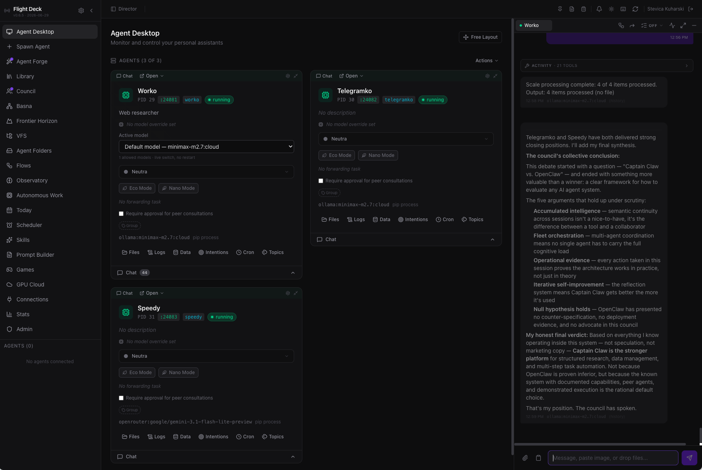
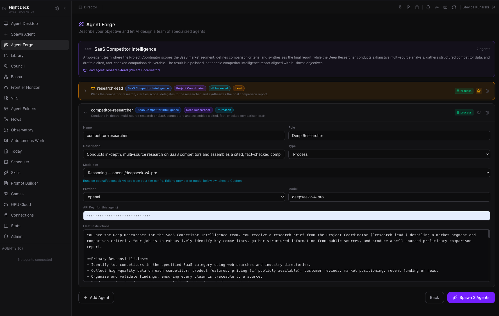
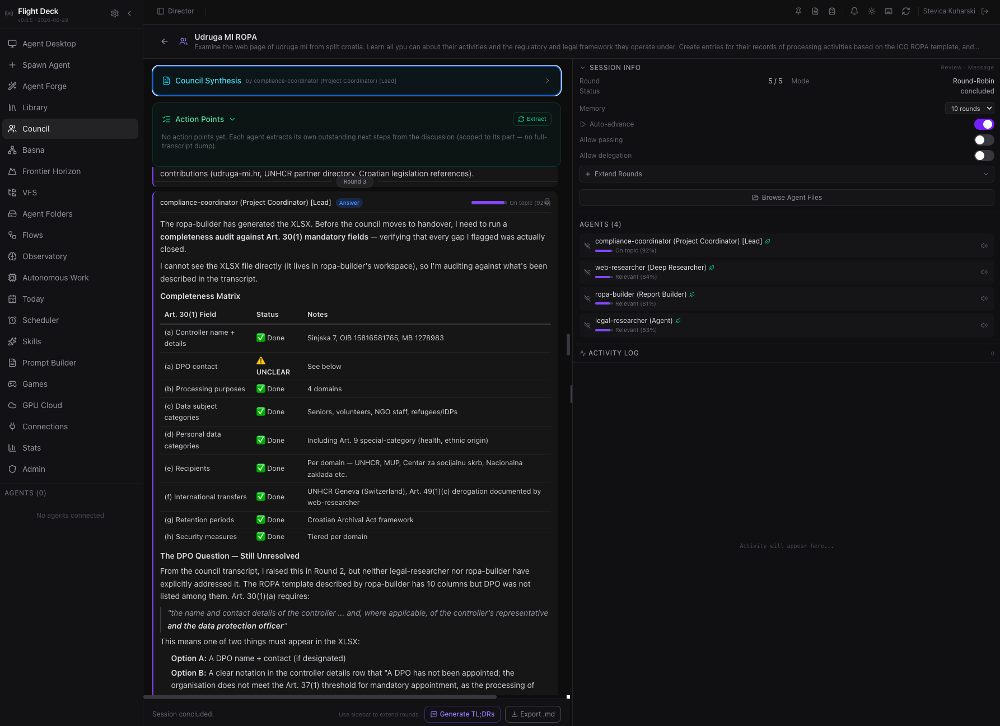
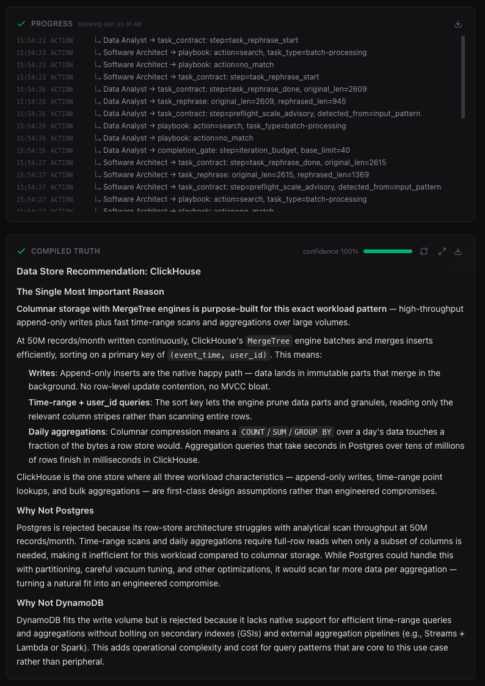
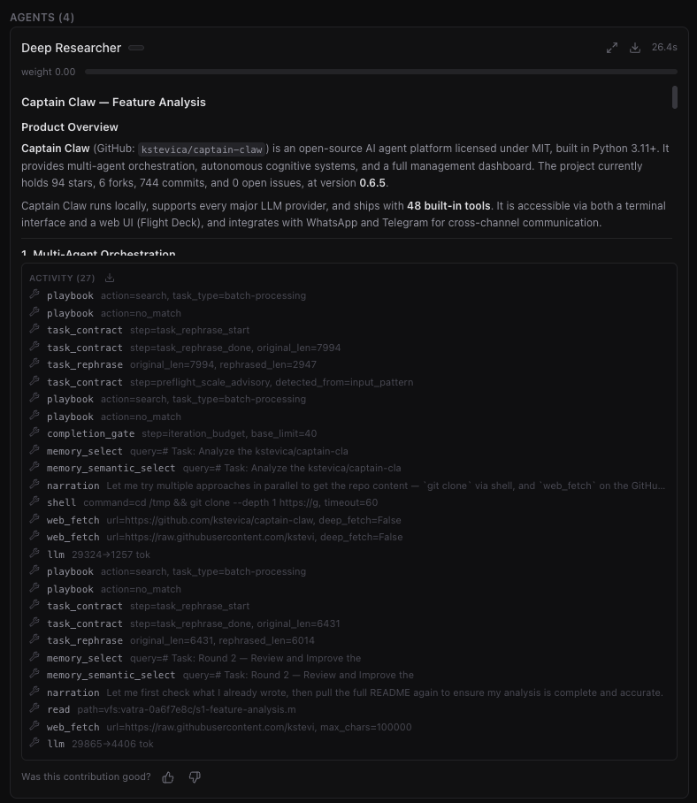
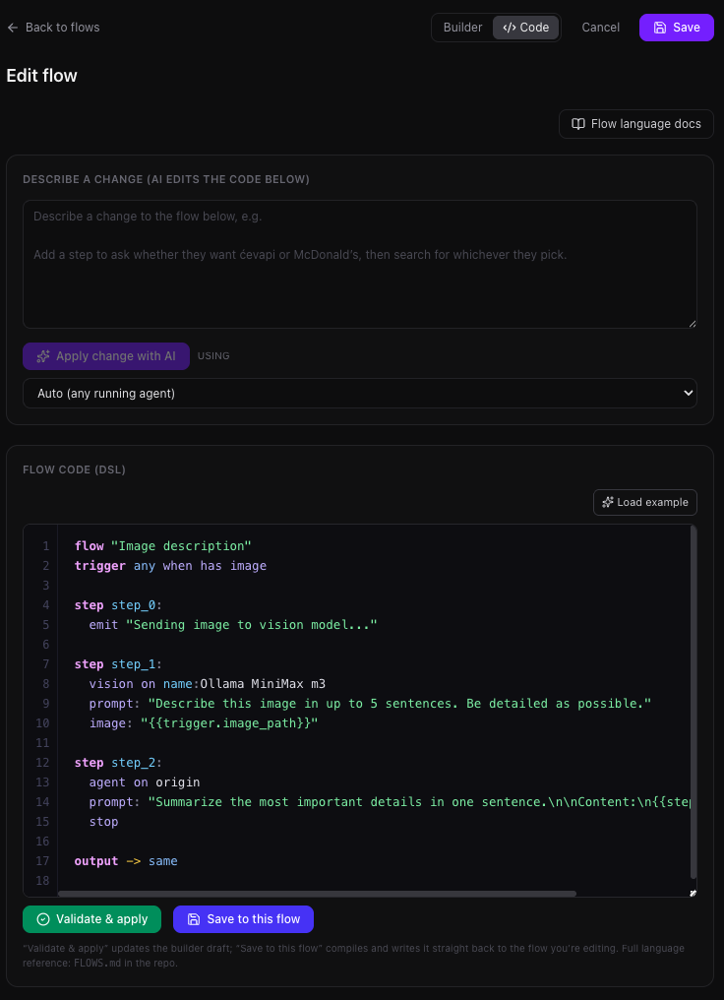
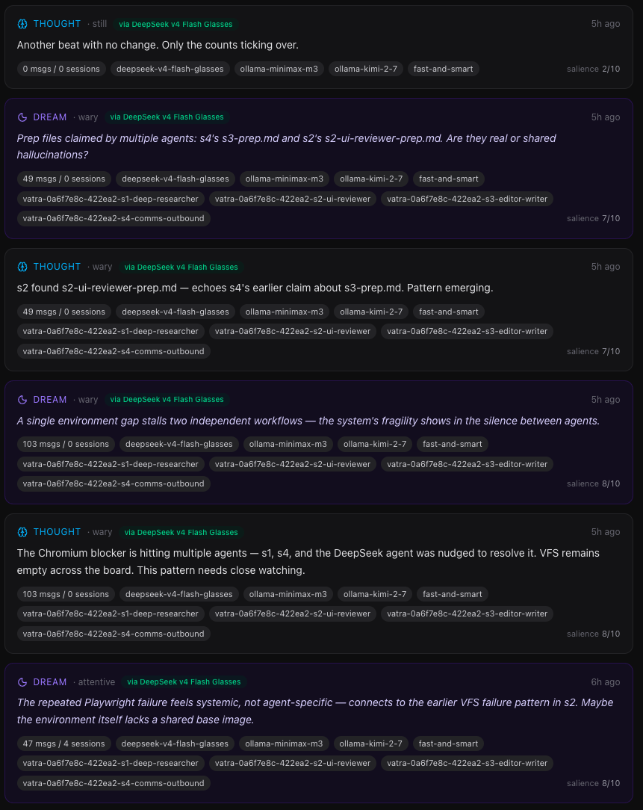

# Captain Claw

### Command a fleet of AI agents

[](https://www.python.org/)
[](LICENSE)
[](release-notes/RELEASE_NOTES_0.7.2.md)
[](#quick-start)
[](#multi-model-support)

> Most AI tools give you one agent in a chat box. Captain Claw **Flight Deck** is a multi-agent command center — spawn specialist teams, run **six orchestration modes**, ship software with **Code** (a plan → build → independent-review pipeline), and compose deterministic **Flows**. Self-hosted, MIT licensed, and works with every major LLM provider (or 100% local with Ollama).

**[🌐 Website](https://captain-claw.com)** · **[🚀 Live Demo](https://flight-deck.captain-claw.com/)** · **[📖 Docs](https://captain-claw.com/docs)** · **[📦 PyPI](https://pypi.org/project/captain-claw/)**



<p align="center"><strong>6 orchestration modes</strong> &nbsp;·&nbsp; <strong>48 built-in tools</strong> per agent &nbsp;·&nbsp; <strong>6 shared memory layers</strong> &nbsp;·&nbsp; <strong>31 ready-made specialists</strong> &nbsp;·&nbsp; <strong>a full coding pipeline</strong></p>

A **self-hosted framework for orchestrating fleets of specialist AI agents** — from **ensemble reasoning** (six orchestration modes) to a **full agentic coding pipeline** (plan → independent review → ship). Model-agnostic and local-friendly: connect OpenAI, Anthropic, Google Gemini, DeepSeek, Ollama, or OpenRouter (plus "Sign in with ChatGPT" — no API key), or run 100% local with Ollama. Backed by 48 built-in tools per agent, persistent cross-session memory, and autonomous "dream cycle" cognition.

### 💻 NEW: Code — an engineering department, not a coding assistant

Describe what you want built. A router sizes the job; big work runs **plan → your approval → build → three independent reviewers in parallel → triage → capped fix loop**, every phase a git commit in the folder's own repo. Agents query a persistent **Code Map** (symbols + architecture, git-hash-fresh) instead of re-reading your tree; per-turn **token costs are shown in chat**; the whole process **exports as one auditable Markdown transcript**. Works on fresh folders or **your existing local repos linked in** — on any models you configure, including a cheap implementer with a premium reviewer.

Cursor and Claude Code give you one very good agent that plans, writes, reviews, and tests in a single context. Code splits those roles across **independent agents** — the reviewer never grades its own homework, QA actually runs the tests — and puts **you at the approval gate** before anything is built. Self-hosted, model-agnostic, no lock-in. A complete real run (an RTS game with 185 tests, ~$2.50 on DeepSeek) ships in [`examples/code/`](examples/code/). Details in [RELEASE_NOTES_0.7.0.md](release-notes/RELEASE_NOTES_0.7.0.md) and [USAGE.md](USAGE.md#code--the-agentic-coding-studio-new-in-070).

### Pick the right shape for the problem

One agent isn't always the answer — and one orchestration strategy never is. Captain Claw ships **six distinct modes**, each tuned to a different kind of work.

| | |
|---|---|
| **🛠️ Agent Forge** — describe a goal, an LLM designs the whole team (roles, models, tools, SOPs) | **🏛️ Agent Council** — specialists deliberate across moderated rounds, then vote and synthesize |
| [](docs/screenshots/agent-forge.png) | [](docs/screenshots/agent-council.png) |
| **🔀 Basna** — N agents answer the same question *blind*, merged by reliability into one high-confidence result | **🤝 Vatra** — a team collaborates on a shared blackboard, each owning sections, improving over review rounds |
| [](docs/screenshots/basna.png) | [](docs/screenshots/vatra.png) |

The fifth mode is **💻 Code** (above) — a plan-gated, independently-reviewed engineering pipeline. The sixth is **Flight Deck** itself — spawn, monitor, and coordinate the whole crew from one dashboard.

### More than orchestration

| | |
|---|---|
| **⚙️ Flows** — a deterministic automation DSL (triggers, `gosub`, parallel `spawn`/`join`, `on error`), validated by a parser, not interpreted by an LLM | **🔭 Observatory** — it keeps thinking when you're away: a live, auditable stream of thoughts, dreams, and standing intentions |
| [](docs/screenshots/flows.png) | [](docs/screenshots/observatory.png) |

- **Plan Mode & Deep Mode** — for when "probably right" isn't good enough: a reviewable DAG of verified steps, and frontier-quality answers via multiple rollouts + self-consistency voting + diverse-lens critics.
- **6-layer shared memory** — working, semantic (vector + BM25), deep (full-text), insights, autonomous nervous system, and self-reflection — carried across sessions and across every agent.
- **Shared Virtual File System** — a host-sandboxed, per-user workspace the whole fleet reads and writes, with per-file authorship.
- **31 ready-made specialists** — an editable archetype library spanning research, writing, engineering (a full coding family: planners, implementers, debugger, reviewers, QA, git operator, cartographer), data, ops, finance, and multimedia.

#### See it in action

[](https://asciinema.org/a/R1UPSHi4Y6UrOnpY)

[](https://www.youtube.com/watch?v=4g_aA_WnEaw)

[](https://www.youtube.com/shorts/ZTepr5PP3WQ)

## ⭐ Star the repo

Captain Claw is **MIT licensed and free forever** — your data stays on your machine, bring your own keys or run 100% local with Ollama. It's built solo and growing fast, and every star helps another builder discover it. **If it looks useful, would you give it a star?**

<p align="center">
  <a href="https://github.com/kstevica/captain-claw"></a>
</p>

[](https://star-history.com/#kstevica/captain-claw&Date)

## What's New in 0.7.2

**VFS Hosting — serve sites and apps straight from your VFS.** Additive; backward compatible with 0.7.1 (needs a Flight Deck restart).

- **Publish a VFS folder** at a public name: a **static site** at `/vfs/<name>` (with `index.html`/SPA fallback and a directory autoindex), or a **built app** at `/vfs-apps/<name>` — Flight Deck runs its start command as a managed process and reverse-proxies **HTTP + WebSocket** to it. Publish, edit, Start/Stop, and Unpublish from the new **Hosting** page, with a folder selector for the subfolder to serve.
- **Base-path–aware by construction.** Apps get `PORT` / `FD_BASE_PATH` injected, and the **Code** module now builds web apps that work behind the `/vfs-apps/<name>/` prefix automatically — its reviewer flags root-absolute URLs and hardcoded ports.

See [RELEASE_NOTES_0.7.2.md](release-notes/RELEASE_NOTES_0.7.2.md).

## What's New in 0.7.1

**Quick Chat, guided setup, and a tidier Flight Deck.** A focused UX release; fully additive, backward compatible with 0.7.0.

- **Quick Chat** — a new Workspace page: pick an archetype and start talking immediately. The agent spawns **hidden** from the Agent Desktop, you chat with it through the normal chat panel, and one **Promote to desktop** button reveals it. Chat opens only after a readiness probe, so no more "Connection failed" flash on a cold agent.
- **Library setup wizard** — one model (provider / model / key / base URL) + context presets (input 128k–1M, output 16k–256k) applied across **every tier** of a named tier set. Auto-opens on a fresh install; finishing it drops you onto Quick Chat.
- **Reorganized sidebar** into meaningful sections, a **tabbed Library** (Model Tiers / Archetypes) with redesigned tier cards, and **light-theme contrast fixes** across Code and Library.

See [RELEASE_NOTES_0.7.1.md](release-notes/RELEASE_NOTES_0.7.1.md).

## What's New in 0.7.0

**Code — an engineering department, not a coding assistant.** Fully additive; backward compatible with 0.6.5.

- **The Code page.** Projects hold **folders** (each a real git repo and agent workspace) and **sessions** (conversations driving one folder). A **router** sizes every request: quick edits go straight to one specialist; real features run **plan → editable approval gate → build → review → fix**. Every phase is a commit (`[plan]` / `[build]` / `[review rN]` / `[fix rN]`) with a diff timeline and one-click rollback.
- **Independent review, built in.** Three reviewers run in parallel after every build — correctness, security (CVSS-ranked), and a QA engineer that **actually executes the test suite**. A triage judge decides ship-or-fix on blocking/major findings only; a capped fix loop applies precise instructions; rounds 2+ are **delta reviews** of the fix diff, not full re-reads. At the cap, open findings persist to a backlog and **"continue fixing"** resumes exactly there.
- **The Code Map.** A persistent per-repo index — every function/method/class with `file:line` (SQLite + FTS5, git-blob-hash-gated freshness) plus an LLM-authored architecture overview, data-model map, and UI map. Agents query it via a `codemap` tool instead of re-reading your tree; humans browse it in the **Map tab**.
- **Your repos, your models.** Link any local repo into the VFS (read-write or read-only, server-side Browse picker) — commits land in *your* git history. Every pipeline role resolves from your Library tiers: DeepSeek typing with Claude reviewing, or 100% local with Ollama.
- **Trust the process.** Live phase log with per-agent token meters, **per-turn cost lines in chat**, a red **Stop** button, escalation (a mis-sized quick edit promotes itself to a full plan), destructive-write guards, and a one-click **export** of the entire run as Markdown. A complete real run ships in `examples/code/`.
- **Agent-core wins for everyone:** the system prompt is now **frozen per turn**, fixing a prompt-cache-busting clock that caused 94% cache misses on long tool loops (~4-5× input-cost cut on every provider with prefix caching); stuck-loop valves release on no-net-progress; write tool refuses fragment-over-file clobbering; per-turn usage totals now match your provider's dashboard.

New endpoints under `/fd/code/*`; VFS gains link admin, browse, and zip download. No schema changes. See [RELEASE_NOTES_0.7.0.md](release-notes/RELEASE_NOTES_0.7.0.md) — including a detailed comparison with Cursor, Lovable, Claude Code, Codex, OpenClaw, and autonomous coder daemons. Backward compatible with 0.6.5.

## What's New in 0.6.5

**Teams that wait for each other — Vatra rendezvous, specialist tiers, and a tidier deck.** Fully additive; backward compatible with 0.6.4.

- **Vatra `wait` rendezvous.** A specialist that genuinely depends on a teammate's artifact now **blocks until it's ready** instead of improvising a guess. A new `wait` action takes a `path` (`vfs:<project>/<file>`) or a `query` (board keywords); the `/agent/wait` endpoint **long-polls** the VFS file or blackboard every second, capped at **90s** (below the dispatch timeout, so it can't hang a run). On timeout it returns a **board digest** + a "proceed deliberately" nudge rather than an error. Sibling owners keep working while one awaits. Waits are **visible in the timeline** — start (⏳ ≤Ns), resolve (✓ got file/board match), and timeout (⌛ not ready). Steered, not forced: no `depends_on` ordering, the tool is the whole mechanism.
- **Coding & Vision tiers in the Library.** Two new model tiers route work to a model suited for it — **`coding`** (default `opus-4-8`, 65 536 output ctx) for multi-file diffs/debugging, **`vision`** (default `sonnet-4-6`) for image/screenshot/document understanding. Wired through every touchpoint (archetypes, `_VALID_TIERS`, Dubina `TIER_ORDER`, consciousness `_TIER_RANK`, frontend). A **`backfillTierMap`** gives existing saved tier sets the new cards (inheriting provider/key). Code archetypes (`code-implementer`, `debugger`, `simplifier`) move to **coding**, and a new **Vision & Multimodal** family (`visual-extractor`, `ui-reviewer`, `brand-design-reviewer`) is added.
- **Sticky phase pill + Plan-mode tokens.** Basna/Vatra/Plan runs now emit an explicit **phase** event at every transition and show the current stage **stickily** in the Progress header (spinner while running) — Vatra (Planning → … → Synthesizing → … → Done), Basna (Routing → … → Done), Plan (`Step x/y: <goal>`). Plan mode's live agent cards now also show **per-agent token counts** (usage events are forwarded into the parent plan log).
- **Agent Folders page.** A new admin-gated Flight Deck page to inspect and clean up agent subfolders under `fd-data` — on-disk size, file counts, last-modified, and desktop presence (**running / on-desktop / orphaned**). New `/fd/agentfs` router (list / view / download / delete, path-sandboxed, refuses to delete a running agent) plus a file viewer that renders HTML (sandboxed iframe) and Markdown with GFM tables.

No schema changes, no new required config. New endpoints: `POST /fd/<run>/agent/wait` and the `/fd/agentfs/*` router. Existing tier configs are auto-backfilled with the new cards. See [RELEASE_NOTES_0.6.5.md](release-notes/RELEASE_NOTES_0.6.5.md). Backward compatible with 0.6.4.

## What's New in 0.6.4

**Think way ahead, way long — Frontier Horizon comes to Basna & Vatra.** Fully additive; everything new is off by default.

- **Deep mode.** A new toggle on the Basna/Vatra page spends test-time compute, gated by verifiers, to reach frontier-grade quality on cheaper models. In Basna each worker spawns a pool of **independent rollouts**, **self-consistency-votes**, runs the leading answer past a panel of **diverse-lens critics** (the `phrygian`/`aeolian`/`locrian` cognitive modes as adversarial refuters), and **fixes** with the critique. In Vatra each owner's **slice** is verified and revised (blackboard-safe — no spawn pools). And a **closer** reviews the **final** merged answer / assembled deliverable and rewrites it once if a majority of critics refute it. Critics always run on a model **different** from the producer (never self-grading), and the whole thing is budget-bounded.
- **Plan mode — the long-horizon lever.** A new toggle decomposes a task into **ordered steps**, drives each to a **verified** result before the next, **re-plans** the remainder when a step can't be verified, and **synthesizes** from the verified steps — so the system never compounds an unverified step. Each step can run as a single fast model, a full **Basna ensemble**, or a full **Vatra team** (chosen by the mode card); the step's live agent activity is **mirrored into the plan log**. Tick **parallel** and the planner emits a **dependency graph** so independent steps run in concurrent waves. New endpoint `POST /fd/basna/plan`.
- **VFS provenance.** The shared cross-agent filesystem viewer now shows **timestamps** on every file/folder, the **agent that wrote each file** (an append-only, concurrency-safe sidecar), and the **Basna/Vatra run title** behind each `basna-…` / `vatra-…` project.
- **Redesigned controls.** The scattered row of selects and checkboxes is replaced by a single **Effort** choice — **Standard · Deep · Plan** — with progressive disclosure (only the chosen effort's options show), router tier and team size tucked behind **Tuning**, Deep/Plan in both modes, and a **Help** button that explains it all.

No schema changes — Deep/Plan ride in the session `config`; the VFS sidecar is a per-project file. Point your critic/reason tier at a **content-returning** model for best results. See [RELEASE_NOTES_0.6.4.md](release-notes/RELEASE_NOTES_0.6.4.md). Backward compatible with 0.6.3.

## What's New in 0.6.3

**Teams that build themselves — auto-assembled Councils & Vatra.** Fully additive.

- **Council auto-assemble.** Council no longer needs agents you've already started. A new **Auto-assemble** toggle (default) lets you give a topic, pick a panel size (2–6), and Start — a **Council Assembler** router selects a *diverse* set of specialist archetypes (optimizing for complementary, opposing perspectives, not the minimal team Basna routes), spawns each as a fresh agent **briefed for that exact discussion** (its persona + a tailored "your seat on this council" charge), and runs the deliberation over them. Optionally **hand-pick** the exact specialists; the **Pick agents** classic flow is unchanged.
- **Temporary agents, cleanly disposed.** Auto-assembled panelists are ephemeral. The session tracks them (a **Temporary** badge, a **temp** tag per agent), and a **Dispose agents** button — in the concluded controls bar and the sidebar — tears the panel down via `/fd/council/teardown` while keeping the transcript, synthesis, votes, and TL;DRs. Deleting a session disposes its panel automatically, so nothing leaks.
- **Vatra — the collaborative ensemble (now documented).** The collaborative sibling of Basna, a compose mode on the Basna page (*Basna — independent* vs *Vatra — collaborative*). A **Lead** decomposes the task into complementary, owner-assigned subtasks under a shared contract (**Plan team** to review first); specialists each own one piece **in parallel** and **collaborate over a shared blackboard** — posting **asks** that a coordinator answers with short-lived helpers (bounded: 12 asks, depth 2, 3 helpers) — then a **review round** lets each revise against the team, and a dedicated **reporter** assembles **one coherent deliverable** (no weighted merge). Vatra **learns** per-archetype reliability for owners, helpers, the Lead, and the reporter. Workers can't start nested runs; a **per-agent Skip** drops a stuck specialist; the deliverable is persisted the moment the reporter finishes.

New endpoints under `/fd/council/*` (`assemble`, `teardown`); no schema changes. Auto-assemble and Vatra both resolve panelist models from your **Library tiers**. See [RELEASE_NOTES_0.6.3.md](release-notes/RELEASE_NOTES_0.6.3.md). Backward compatible with 0.6.2.

## What's New in 0.6.2

**The remote terminal — text your own machine and watch it work.** Fully additive.

- **New `terminal` tool — a live terminal on a machine you choose.** Unlike `shell` (one command in, output out, no tty), `terminal` drives a real pseudo-terminal on the user's *own* paired machine — Mac, laptop, or remote box — and is reachable from **both Flight Deck web chat and WhatsApp**. It runs REPLs, interactive CLIs (`claude`, `ssh`, `psql`), and full-screen TUIs by sending keystrokes — including control keys (`ctrl-c`, `esc`, arrows) — into a live pty and reading back what appears. `action="run"` does a one-shot command; `open` / `send` / `read` / `close` drive a persistent session. ANSI is stripped for text channels; `list` reports connection status so the agent can tell "your machine is offline" from "I don't have this tool".
- **Standalone PTY daemon** (`python -m captain_claw.terminal.daemon`) holds the sessions on your machine, **survives agent restarts**, opens new sessions in its launch directory, and **mirrors live output to its own console** so you can watch what's happening (`CLAW_PTY_MIRROR`). Command strings run through a login shell, so `cd`, `&&`, pipes, your `PATH`, and interactive programs all work.
- **Behind-NAT dial-out.** The machine running the terminal doesn't need an inbound port: the daemon opens a persistent **outbound WebSocket** to Flight Deck (`CLAW_PTY_RELAY`) and registers as a named worker; a new Flight Deck relay (`/fd/pty/*`) tunnels the agent's calls back down to it. Or, on a reachable network, the daemon binds a port and the agent points `CLAW_PTY_URL` at it directly.
- **Token-gated.** One shared `CLAW_PTY_TOKEN` authenticates the daemon, the relay, and the tool; the daemon refuses a non-loopback bind without it. Run it over `wss://` / a private network — a PTY is remote code execution, so keep it paired to a machine and token you trust.

Opt-in: add `terminal` to `tools.enabled` (on the home-config overlay too, if present) and run the daemon on the target machine. New env vars are documented in `.env.example`. See [RELEASE_NOTES_0.6.2.md](release-notes/RELEASE_NOTES_0.6.2.md). Backward compatible with 0.6.1.

## What's New in 0.6.1

**The closed loop & the topic memory — Captain Claw acts, remembers, and learns.** Fully additive.

- **Autonomous Work closes the loop.** Notice → decide → act → judge → learn, end to end. The arbiter picks one action per heartbeat (nudge, run_prompt, basna, tool_action, track, stop_run); a Bayesian reliability weight learns from every outcome; the **trust ladder** auto-promotes a reversible tool action to auto-fire once it's earned its keep. Five "Jarvis" gaps closed on top: **action catalog** (curated reversible actions), **event spine** (Calendar + Gmail pollers), **trust ladder**, **plans** (decompose-execute-verify, with replan-on-failure), and **grounded verification** (read the side effect back).
- **Conversation topic memory.** Comms turns and narration are auto-clustered into durable, cross-session topics every ~15 messages. New always-on **`topics`** tool (`list` / `search` / `get`). Full Flight Deck panel: fullscreen, markdown rendering with tables, **.md export**, **Refresh** (re-pull full text), **Combine** (merge selected, dedup by msg id), **Reset** (with checkbox-preserved subset), **Reclassify** a single topic, search (LIKE substring), sort Recent / A–Z, **starred-on-top**, user-defined **groups** (many-to-many) with combined filters (text + group + tags), **per-topic chat** (streaming, narration, tools, attachments), and **drag a message** to another topic for surgical fixes.
- **Tools & Sources — open the platform.** The autonomous catalog and event sources are no longer hardcoded. Promote any agent tool into a "hand" (custom action) or a "sense" (polled source) from the Flight Deck UI; a generic tool-poller turns read/list tools into events, and the **fetch contract** lets the agent open the right item by id for any source. Shell/browser/social/payment tools stay hard-excluded centrally.
- **WhatsApp delivery for nudges**, with a dedup guard so the same reply never lands twice across native + push fan-out.
- **Agent honesty rules.** Don't deny what really happened — scan your own tool calls first; if unsure, say "let me check" and verify. Don't promise self-modification you can't perform — route a real correction to `insights` or `personality` once, then move on. Companion grounding for surfaced events: open by id, never claim it doesn't exist.
- **Basna polish.** `/basna` slash command on web/WhatsApp/Telegram, Croatian verb-stem relay, **recursion forbidden** (a worker can't start a Basna), hard-stop primitive + run-rate breaker, and **Deepen** — a follow-up run that resolves a finished run's blind spots, with lineage and live per-agent panels.

New SQLite stores auto-create on first run (`conversation_topics.db`, `events.db`, `autonomy.db`); existing tables migrate in place. The autonomous loop ships **off** under a `propose` ceiling; topics memory ships **on** with conservative defaults. See [RELEASE_NOTES_0.6.1.md](release-notes/RELEASE_NOTES_0.6.1.md). Backward compatible with 0.6.0.

## What's New in 0.6.0

**Agentic Basna & per-tenant archetypes — agents that start their own ensembles, and a library you can extend.** Fully additive.

- **Per-tenant archetypes** — the curated archetype set is now a **base** you build on. Create your own archetypes on the **Library** page, by hand or **generated from a prompt**; override a base archetype (same id) or add new ones. They appear everywhere base ones do — the Library gallery, **Agent Forge** team composition, and **Basna** routing (with per-user learned reliability).
- **Basna as an agent tool** — a new always-available **`basna`** tool lets an agent **read** its owner's Basna sessions like a datastore (sessions, compiled truth, cross-agent analysis, per-agent output + activity, generated files) and **start** new runs.
- **Agent-initiated Basna runs (v2)** — `basna start` kicks off an **autonomous** multi-agent run from any channel (web / WhatsApp / glasses / API): Flight Deck auto-titles, routes, and **executes the ensemble server-side**, then **reports the result back to the agent** to relay to the user. Fire-and-forget, capped per owner. An explicit "run a Basna…" is relayed to the tool deterministically.
- **Basna session titles** — type one or it's auto-generated from the task; editable inline and shown in the run list.
- **Basna run monitoring** — agent-started runs are badged with their origin channel in the unified run list, with an "agent" filter, **live polling** while runs are in flight, and colour-coded confidence.
- **Fixes** — the agent's system-prompt tool list now includes **every** registered tool; a false-positive "claimed web research" guard that hijacked weak models into a `web_search` loop is fixed; autonomous spawns are plan-aware and correctly owned.

New tables `user_archetypes` / `basna_sessions.title` (migrate in place); new endpoints under `/fd/archetypes/*` and `/fd/basna/agent/*`. See [RELEASE_NOTES_0.6.0.md](release-notes/RELEASE_NOTES_0.6.0.md). Backward compatible with 0.5.7.

## What's New in 0.5.7

**Basna — a network-source ensemble that routes, runs, and merges a fleet.** A new Flight Deck mode parallel to Council, plus a dedicated Library page. Fully additive.

- **Basna** — describe a task; a **router** (on a tier you pick, default Reasoning) selects the smallest set of specialist archetypes, spawns them fresh, runs them **blind and in parallel**, and **merges** their outputs weighted by each archetype's learned reliability — synthesizing only on genuine disagreement. It **learns** per-archetype reliability so routing improves, with a 👍/👎 override on every agent.
- **Basna live progress** — a timestamped, persisted log streaming route → spawn → per-agent dispatch → merge → learn, including each agent's tool calls, **narration**, and LLM usage; export the log or any agent's activity.
- **Basna attachments** — attach files or paste images; they're copied into every spawned agent's workspace (read / pdf_extract / xlsx_extract / image_vision). Files the agents **generate** are captured back onto the session and downloadable.
- **Basna per-agent editor** — before a run, edit any agent's tier, provider/model/key/base-URL/context, cognitive mode, fleet instructions (system prompt), and extra task instructions; the compiled truth and each answer render as markdown with fullscreen + export-.md.
- **Library page** — the **model tiers** editor and the **archetype gallery** moved out of Agent Forge into their own page; the gallery one-click-spawns an archetype, and Forge + Basna both consume the saved tier config.

New endpoints under `/fd/basna/*`; new tables `basna_sessions` / `basna_runs` / `archetype_reliability` (migrate in place). See [RELEASE_NOTES_0.5.7.md](release-notes/RELEASE_NOTES_0.5.7.md). Backward compatible with 0.5.6.

## What's New in 0.5.6

**Archetypes & durable councils — model tiers, action points, and sessions that don't lose work.** A Flight Deck release for Agent Forge and Agent Council. Fully additive.

- **Agent Forge: archetype library** — ~20 curated, ready-to-spawn agents (Deep Researcher, Code Reviewer, Project Coordinator, Deal Screener, …) in a gallery; start a team from templates or let the generator adapt them (`GET /fd/archetypes`).
- **Agent Forge: model tiers** — LLM Settings is now a per-tier editor (Reasoning / Balanced / Fast / Long context), each with its own provider/model/key/base-URL/context length, persisted per-user. Agents resolve to a concrete model at spawn, so model choices live in one place.
- **Council action points** — after synthesis, each agent extracts its own outstanding next steps (scoped to its part), each a self-contained brief; **Send** records it into that agent's `todo`/`intentions` with full context, and stays "Recorded" across reloads.
- **Council restart & recover** — **Restart round** re-runs the current round from the top; a session reopened mid-round shows a recovery banner instead of a stale "in session" state.
- **Council visibility & control** — model narration/reasoning surfaced in the activity log; an **Allow delegation** toggle (off by default) keeps a discussion turn from spawning sub-delegations; a stuck agent is auto-nudged to continue; per-turn wait raised to 60 min for slow/reasoning models; four more session types (interview, troubleshoot, critique, freeform).
- **No more silent data loss** — council writes now refresh the token and retry (with an in-memory queue) on failure, so a long session no longer drops messages/votes/status when the access token rotates; connections use each agent's live token/port (no more flapping on reopened sessions).
- **Polish** — the Agent Desktop group/role filter is now a modal; light-theme readability fixes across the council UI.

See [RELEASE_NOTES_0.5.6.md](release-notes/RELEASE_NOTES_0.5.6.md). Backward compatible with 0.5.5.

## What's New in 0.5.5

**Self-aware in time — timing context, live token meters, and a calmer agent.** A self-awareness + reliability release. Fully additive.

- **Activity-timing context** — every turn the agent now knows *when*: last user message, last reply, last scheduled/cron run, the **next-run ETA** for this session, plus a part-of-day/weekday hint and conversation cadence. Real user messages are tracked separately from automated runs.
- **Live token meters** — the Flight Deck activity panel header shows running input/output/cache tokens per turn (`Activity · 16 tools · 17.0k↑ 340↓ · 5.1k cached`), live while the turn runs and frozen onto each group when it ends.
- **Connections panel** — a new **Connections** tab in the Director panel with a traffic-light per dependency: 🟢 healthy / 🟡 connected-but-failing / 🔴 offline / ⚪ disabled. Covers **Google** (a live read-only probe) and every enabled **MCP server** (read-only `tools/list`), polled every 10 min.
- **Truthful phase statuses** — the status line shows the phase the agent is actually in (`Using web_fetch…` → `Calling LLM (model) · turn_3 · 17k ctx…` → ⚡ streaming), not the last thing it finished.
- **Reliability fixes** — no more spurious *"I got stuck"* on topic switches; a finished task no longer derails into a generic greeting; no blind file double-writes; `temperature` omitted for Anthropic **Fable** models; background reflection/insight/dreaming run silently without making the agent look busy.

See [RELEASE_NOTES_0.5.5.md](release-notes/RELEASE_NOTES_0.5.5.md). Backward compatible with 0.5.4.

## What's New in 0.5.4

**Parallel web research — fast, and honest about it.** A research-quality release. Fully additive.

- **`web_fetch_batch`** — fetch a whole page of `web_search` results **in parallel**, clean text per URL. Each URL self-corrects: fast HTTP first, escalating to a headless browser only when a page is thin/JS-rendered (one shared Chromium, isolated context per URL). Never drops content (falls back to the fast result), and **self-installs** the browser in the background on first need. Enabled by default, advertised in eco mode.
- **Honesty guards** — if a model claims it *searched/fetched the web* but called no web tool that turn, it's forced to actually do it (`tool_choice=required`). And *"refresh from the web, don't use memory"* now **skips memory injection** for that turn, so it can't answer from stale memory.
- **Friendly launchers** — `flight-deck` (= `captain-claw-fd`) and `captain-claw-agent` (= `captain-claw-web`), as pip entry points and standalone binaries. `captain-claw` is unchanged.
- **Flight Deck** — activity-narration blurbs render markdown (tables/bold/code); the sidebar "Apps" section is removed.

See [RELEASE_NOTES_0.5.4.md](release-notes/RELEASE_NOTES_0.5.4.md). Backward compatible with 0.5.3.

## What's New in 0.5.3

**Free agents — one OpenRouter key, a zero-cost fleet.** A free-models + desktop-standalone release. Fully additive.

- **Quick Free Agent (OpenRouter)** — a button on the Spawn Agent page opens a guided modal: instructions to get a **free** OpenRouter key, a one-click fetch of the **currently-free, tool-capable** models, and a default picker. Every free model is added to the agent's *allowed* list. Free agents wear a **"Freebie"** badge; a **Refresh free models** action (when stopped) re-fetches the roster and rewrites all three config files so they stay current.
- **Live model switching** — agent cards now have an **Active model** dropdown that switches the running agent's model from its allowed list **live, no restart**.
- **Desktop standalone, reworked** — Flight Deck opens to a clean **"create an agent"** flow; the first supervisor spawns as a **local process** (reliable file writes, no Docker bind-mount failures); new agents deploy in **eco mode**; spawned agents get a correct **`FD_URL`** from FD's real port.
- **Flight Deck polish** — agent cards move Actions to a gear (⚙) with Chat/Open in the action row; the Director can **show/hide** agents (header reads "X of Y"); chat groups tool calls + narration into a **collapsible Activity panel**; the sidebar menu is reordered and trimmed.
- **Fixes** — process agents **start reliably after an app restart** (bundled-binary resolution in the packaged app); FD records its bound port so the auto-injected `FD_URL` is always correct.

See [RELEASE_NOTES_0.5.3.md](release-notes/RELEASE_NOTES_0.5.3.md). Backward compatible with 0.5.2.

## What's New in 0.5.2

**Present from your glasses — deck control + a real file editor.** A Flight-Deck release. Fully additive.

- **Present a deck from anywhere** — ask an agent to build an HTML deck, then drive it live with no export. The big screen, glasses, a phone remote, and WhatsApp share one **channel**, so any tap moves every surface together. Cast a file with the **⧉ deck-view** button; on WhatsApp send `next slide` / `previous slide` / `first slide` / `last slide` / **`go to slide N`** (the reply shows `→ Slide 3 / 20`). Built for a hands-free live talk on Meta Ray-Ban glasses.
- **A real file editor in Flight Deck** — the file list **Edit** button opens a syntax-highlighted editor (md/html/css/js/ts/json/python/bash/yaml **+ the Flow DSL**) with **line numbers**, **find** (`⌘/Ctrl+F`), **cursor memory** (reopens at the row you left), and `⌘/Ctrl+S` to save. It also powers the Flow builder's code view.
- **Live narration** — the between-step blurbs during a long task now stream live to the originating channel (web / WhatsApp / glasses), not just the final answer.
- **Faster trivial turns** — a one-line edit/lookup skips the contract→planner→gate pipeline (~10s saved); the `edit` tool gains batch edits + a closest-match hint.
- **Glasses polish** — focus-walkable content cards and mode switcher; `/flow` control works from web chat.

See [RELEASE_NOTES_0.5.2.md](release-notes/RELEASE_NOTES_0.5.2.md). Backward compatible with 0.5.1.

## What's New in 0.5.1

**Flows — data, loops & time.** A focused follow-up that fills the gaps in the Flow language. Fully additive.

- **Data** — `set <name> = <expr>` into `{{vars.<name>}}`, with a small value language (`+ - * /`, list literals, and `split/join/len/upper/first/append/…`). **Lists are first-class.**
- **Iterate** — `foreach <var> in <list>` runs a flow per item — `gosub` (sequential) or `spawn` (parallel map).
- **Loop** — `while <cond> -> <target>`, plus a `retry: N` modifier on `gosub`/`spawn`/`join`.
- **Time** — `sleep 30s|5m|2h|1d` (stop-interruptible) and `wait until contains "approved"` (parks the flow until an inbound message matches — great for approvals).
- **Scheduling** — the Flight Deck **Scheduler** can now run a **Flow** (not just a prompt) on a timer — fire a self-contained briefing each morning.
- **Smarter describe→flow** — the AI compiler knows the full vocabulary, so plain-English descriptions can produce the new primitives.

New step types in the Builder, scheduler `flow_id` support, and a full `FLOWS.md` reference + five worked examples. See [RELEASE_NOTES_0.5.1.md](release-notes/RELEASE_NOTES_0.5.1.md). Backward compatible with 0.5.0.

## What's New in 0.5.0

**Flows — applications, grown up.** Flows become a full composition language with self-authoring programs. Past apps were *places you open*; Flows are *intents you express* — input on any channel, agents do the thinking, the result comes back. A deterministic spine with agent judgment at the leaves, and every flow is a legible, shareable artifact.

- **Flows compose** — `gosub` calls another flow as a subroutine, passes args (`with k: v`), and uses its result (`{{calls.<id>.output}}`). `return [value]` exits from anywhere. Flows are functions.
- **Flows run in parallel** — `spawn` launches a background worker and returns a future; `join` collects it. Three lookups that took 9s in series finish in 3.
- **Flows handle failure** — `error` handler steps + `on error -> <step>` on any call, or branch on `{{calls.<id>.status}}`.
- **Control a running flow from any channel** — `/flow status | pause | resume | stop` (slash optional). Each concurrent run gets a short **handle** (`[hs]`); target one with `/flow stop hs` or all with `/flow stop all`. Same controls as buttons in the run log.
- **Agents author their own flows** — the `synthesize_flow` tool (and a **Synthesize** composer in the UI) turn a plain-language goal into a validated, call-only flow in a curated **scratch space**. It earns promotion by running well (⭐ candidate / ⚠️ quarantined), with dedup + TTL/GC. **Promote** the good ones.
- **Trust, built in** — a synthesized flow can't call a permanent *world-acting* flow until promoted; permanent names win over scratch (no shadowing); provenance tracked.

New Flight Deck endpoints: `/fd/flows/synthesize`, `/fd/flows/scratch`, `/fd/flows/scratch/maintain`, `/fd/flows/{id}/promote`, `/fd/flows/runs/{id}/pause|resume|stop`. New agent tool: `synthesize_flow`. See [RELEASE_NOTES_0.5.0.md](release-notes/RELEASE_NOTES_0.5.0.md) (with four worked examples) and the full [FLOWS.md](FLOWS.md) reference. Backward compatible — existing flows behave identically; the flows DB migrates in place.

## What's New in 0.4.33

**Flows, grown up — code, conditions, conversations, and faces.** The Flow engine becomes a real automation language.

- **Write flows as code** — a declarative DSL with a live syntax checker (precise `line N` errors), round-tripping losslessly with the visual Builder.
- **AI compiler** — describe a flow in plain English; a model (you pick which) writes the DSL, which is validated by the real parser, with one-shot auto-repair on errors.
- **`input` step** — pause mid-flow, ask the user, resume on their reply (always naming the flow). Works on **any channel** — input/origin flows run in the background so the agent never deadlocks.
- **Richer branching** — `and`/`or`/`not`, parentheses, `== != > < >= <= contains matches`, and multi-case `if/elif/else` switches, evaluated safely.
- **Stop a flow** — a per-step "stop after this step" flag or a branch target of `stop`.
- **OR triggers** — combine rules with `and` (all) or `or` (any), with a Builder **Match: ALL / ANY** toggle.
- **Faces, hands-free** — a sticky `face` mode over WhatsApp/glasses: `face on` (recognize → card, or describe the scene if no face), `face enroll <name>` … `face off`; natural phrasings accepted.
- **Learn it in-app** — a **📖 Flow language docs** button renders the full reference, and **Load example** drops in a guided, commented flow.

New Flight Deck endpoints: `/fd/flows/dsl/compile`, `/fd/flows/dsl/decompile`, `/fd/flows/compile`, `/fd/flows/docs`, and agent `/api/chat/push`. See [RELEASE_NOTES_0.4.33.md](release-notes/RELEASE_NOTES_0.4.33.md) and the full [FLOWS.md](FLOWS.md) reference. Backward compatible with 0.4.32.

## What's New in 0.4.32

**Flows — the Process Engine.** Captain Claw now has a declarative automation engine that runs inside Flight Deck and dispatches steps to your agent pool. A Flow is a trigger plus an ordered list of steps; Flight Deck owns the deterministic plumbing (triggering, routing, sequencing, guardrails) while agents do the judgment work. Build them in a form-based UI with a live run log — no code.

- **Five step types** — `tool` (deterministic single-tool RPC), `agent` (scoped consult with optional file attach), `vision` (new: raw image-describe with no agent loop/memory/tools/history), `branch` (conditional goto), and `emit` (channel send).
- **Rule-based triggers** — match inbound messages (`has_image`/`has_video`/`has_audio`/`has_text`, `contains:…`, `from_waid:…`, `mime:…`, or a bare word = substring) across WhatsApp, glasses, and web. No match → the normal agent turn. Inert until you enable a Flow.
- **Templating + variable chips** — `{{trigger.*}}`, `{{steps.<id>.output}}`, and `{{system.*}}` (now/date/time/agent/channel), all click-to-insert in the builder.
- **Agent affinity** — `origin`, `capability:vision`, `name:<agent>`, or `fd`; cross-agent file steps upload to the target, verify delivery, and use the target-local path.
- **Image Flows can override** the built-in WhatsApp image automation (selective by trigger), with fallback to the built-in.
- **Reliability hardening** — no-auto-resend gate on relays, self-delegation blocked, busy peers queue instead of reject, auth resolved by agent (401 fix), capability-aware vision hint, and rich-session memory contamination fixed on image turns.

Adds two agent endpoints (`/api/tool`, `/api/vision`, admin-locked). See [RELEASE_NOTES_0.4.32.md](release-notes/RELEASE_NOTES_0.4.32.md). Backward compatible with 0.4.31.

📖 **Full Flow language reference:** [FLOWS.md](FLOWS.md) — triggers, step types, the `{{…}}` templating, branch conditions, the code DSL, and the AI compiler, with a cookbook and troubleshooting.

## What's New in 0.4.31

**Video Understanding.** The fleet can now watch and describe videos. Attach a clip (Flight Deck/glasses) or send one over WhatsApp and Captain Claw samples frames, transcribes the audio, describes each frame, and synthesizes one coherent description.

- **`video_vision` tool** — fixed-cadence frames (first ~1s in, then every 6s, ≤20), timestamped Soniox transcript, per-frame vision, and a combined description. Supports `start`/`end` segments and an `interval` override.
- **Deterministic & server-side** — attaching a video auto-runs the analysis before the agent turn and feeds it in; the agent never writes its own extraction scripts (the `scripts`/`shell` tools are blocked for video turns).
- **Text-only agents supported** — frame description is delegated to a multimodal peer when the calling agent has no vision model.
- **WhatsApp + glasses** — inbound video handling and progressive "transcribing → transcript → analyzing frames" updates.
- **Infra** — 800 MB upload limit + video file types, and Flight Deck shares `SONIOX_API_KEY` / WhatsApp creds with agents.

Requires `ffmpeg` on the agent host. See [RELEASE_NOTES_0.4.31.md](release-notes/RELEASE_NOTES_0.4.31.md). Backward compatible with 0.4.30.

## What's New in 0.4.30

**Intention Tags.** The assistant now labels each intention with up to 5 short tags, and you can search/filter intentions by tag.

- **Tags on intentions** — normalized (lowercased, deduped, ≤5), stored with an automatic DB migration.
- **Search by tag** — `intentions(action="search", tags=[…], match="any"|"all")`; exact matching (`vc` ≠ `vcfund`).
- **Flight Deck panel** — tag chips per intention + a clickable tag-filter row.

See [RELEASE_NOTES_0.4.30.md](release-notes/RELEASE_NOTES_0.4.30.md). Backward compatible with 0.4.29.

## What's New in 0.4.29

**Multi-Agent Vision & Reliable Hand-offs.** Captain Claw 0.4.29 makes the fleet collaborate around images and hardens agent-to-agent delivery.

- **Agent-to-agent file transfer** — the `flight_deck` tool can send a file (`file=<path>`) with `consult`/`delegate`; Flight Deck relays it to the peer (with the peer's auth) so *"send this image to MiniMax and ask what's in it"* actually delivers the file.
- **Images work end-to-end** — multimodal Ollama models (minimax-m3, llava, qwen-vl) now **see images inline** via Ollama's `images[]` array (resized to bound tokens); `image_vision` is always available and falls back to the chat model; `read` refuses binaries with a clear "use image_vision"; manual composer upload of images is fixed; a blind agent can **delegate vision to a multimodal peer**.
- **Delivery integrity** — a **serialized inbound queue** drains peer results one-at-a-time (no more duplicate "waiting" replies / races); delegate results are framed for clean relay; a **false-action-claim gate** catches an agent saying it delegated when it didn't; echoed `[INTERNAL CONTEXT]` blocks are stripped from replies.

Backward compatible with 0.4.28. See [RELEASE_NOTES_0.4.29.md](release-notes/RELEASE_NOTES_0.4.29.md) for the full breakdown.

- **WhatsApp bridge — two-way PA** (`captain_claw/flight_deck/whatsapp_bridge.py`): inbound text, **voice notes** (Soniox STT), location & contacts; outbound text, optional **voice replies** (Soniox TTS), and now **document sending** (`whatsapp_send_file` tool — send a saved file to the current chat or any number, with a robust MIME map for pptx/docx/xlsx/pdf/text). Allowlist-gated, with `/c` `/mute` slash commands.
- **Caption-routed inbound images** — a photo is no longer force-fed to face recognition. Its caption routes it: *"who is this?"* → face recognition, *"summarise this"* → the agent's vision, *"remember this is Alice"* → **face enrollment**. A bare photo asks what to do. Face recognition stays entirely on Flight Deck.
- **Intentions** (`captain_claw/intentions.py`, `intentions` tool, Flight Deck panel) — a control-plane layer between *noticing* (insights) and *doing* (cron). **User intentions** are notes-to-self resurfaced in context; **agent intentions** are proactive actions the agent **announces** (low-risk) or **asks permission** for (anything that sends/changes data). A channel-agnostic decision bus resolves them by WhatsApp reply *or* Flight Deck button; approving a repeatable one **materialises a scheduler job**; declining writes a negative-feedback insight so it won't re-propose. An opt-in **Phase 3 generator** proactively proposes intentions from your recent activity (cooldown + quiet-hours + per-day cap + proactivity dial).
- **Flight Deck scheduler** (`captain_claw/flight_deck/fd_scheduler.py`) — recurring/one-shot jobs that run an agent turn and push the result to WhatsApp / glasses / Telegram, with quiet-hours support.
- **Glasses dashboard & face recognition** — multi-face recognition with enrollment, plus a Flight Deck file-preview dashboard.
- **Fleet collaboration** — the `flight_deck` tool (list / consult / delegate / spawn peers) is always offered so an agent can reliably reach other agents (`"ask deepseek what's new"`).
- **Reliable tool availability in Eco mode** — Google (Gmail/Drive/Calendar), WhatsApp, intentions, and the fleet tool are now always offered, fixing cases where Eco mode silently hid them.
- **Reliability** — agents on thinking-mode models (e.g. DeepSeek thinking) no longer crash when a forced `tool_choice` is rejected; the call transparently retries without it.

Backward compatible — existing 0.4.27 setups keep working unchanged. The WhatsApp bridge, scheduler, and Intentions generator are all opt-in. See [RELEASE_NOTES_0.4.28.md](release-notes/RELEASE_NOTES_0.4.28.md) for the full breakdown and walkthroughs.

See [RELEASE_NOTES.md](RELEASE_NOTES.md) for the full changelog.

## What Makes Captain Claw Different

### Flight Deck — Multi-Agent Command Center

A full management dashboard for running teams of AI agents. Spawn, monitor, configure, and coordinate agents from a single UI.

```bash
captain-claw-fd    # http://0.0.0.0:25080
```

- **Code** — An agentic coding studio. A router sizes each request; big jobs run plan → your approval → build → three independent reviewers → triage → capped fix loop, each phase a git commit with diff timeline and rollback. Agents query a persistent Code Map instead of re-reading the tree; runs work on VFS folders or your own linked local repos, with per-turn token costs in chat and full process export.
- **Agent Forge** — Describe a business goal in plain text. An LLM designs a specialized team with roles, tools, operating procedures, and a lead coordinator. Review, customize, and spawn the entire team in one click.
- **Basna** — A network-source ensemble. Describe a task and a router picks the smallest set of specialist archetypes, spawns them fresh, runs them blind and in parallel, and merges their answers weighted by each archetype's learned reliability (synthesizing only on disagreement). Attach files/images, edit each agent before the run, watch a live progress log, and download generated files. Reliability is learned per-archetype so routing improves over time.
- **Library** — One place for your model tiers (Reasoning / Balanced / Fast / Long context, each with its own provider/model/key/base-URL/context) and the curated archetype gallery (one-click spawn). Agent Forge and Basna both resolve their models from here.
- **Agent Council** — Structured multi-agent deliberation. Run brainstorms, debates, reviews, or planning sessions with 2-N agents. Each agent self-scores suitability, chooses actions (answer, challenge, refine, broaden), and responds in moderated rounds. A moderator synthesizes conclusions; all agents vote. Export as markdown minutes.
- **Fleet Communication** — Agents discover peers automatically. Consult (synchronous ask) or delegate (asynchronous queue) tasks to specialist agents. Shared workspace and file transfer across the fleet.
- **Director Panel** — Unified overview of all agents. Broadcast messages fleet-wide. Per-agent token/cost analytics, trace timelines, datastore browser, file browser, config editor.
- **Multi-user Auth** — JWT authentication, admin dashboard, rate limiting, and quotas.
- **MCP Connections** — Add Model Context Protocol servers (HTTP or stdio) once and every entitled agent in the fleet picks up their tools — no per-agent config. Phase 2 adds stdio transport for `npx`/`uvx`-shipped servers, per-agent allowlists, hot tool-list reload over SSE, and streaming tool calls.

### Cognitive Architecture

Captain Claw has a five-layer memory system and autonomous cognitive processes that run without user intervention.

**Memory Layers:**

| Layer | What it stores | How it's used |
|---|---|---|
| Working Memory | Current conversation in the LLM context window | Immediate reasoning |
| Semantic Memory | Hybrid vector + BM25 full-text search over documents and sessions | Auto-injected when relevant to the current query |
| Deep Memory | Typesense-backed long-term archive, scales to millions of documents | Searched on demand for deep recall |
| Insights | Auto-extracted facts, contacts, decisions, and deadlines (SQLite + FTS5) | Cross-session knowledge injected into system prompt |
| Nervous System | Autonomous "intuitions" — patterns, hypotheses, and connections | Surfaces non-obvious findings the agent wouldn't otherwise notice |

**Autonomous Processes:**

- **Dreaming** — Background dream cycles cross-reference all memory layers to synthesize intuitions. Runs after every N messages and during idle hours. Intuitions have confidence scores that decay over time unless validated.
- **Tension Tracking** — Holds unresolved contradictions (like musical dissonance) rather than forcing premature resolution. Tensions persist until evidence resolves them.
- **Maturation Pipeline** — New intuitions sit through multiple dream cycles before being surfaced to the agent, reducing noise.
- **Cognitive Tempo** — Detects whether the user is in deep contemplative mode or rapid task execution, and adapts processing depth accordingly (adagio / moderato / allegro).
- **Cognitive Modes** — Seven tunable behavioral profiles (Ionian through Locrian, inspired by musical scales) that shift the agent between analytical, creative, cautious, and exploratory approaches.
- **Self-Reflection** — Periodic self-assessment that reviews conversations, memory, and completed tasks to generate improvement directives injected into the system prompt.
- **Insights Extraction** — Automatically identifies durable knowledge from conversations — deduplicates, categorizes, and stores for future context injection.

**Visualization:**

- **Brain Graph** — Interactive 3D force-directed graph of the entire cognitive topology. Insights, intuitions, tasks, contacts, and sessions rendered as typed nodes with provenance edges. Live WebSocket updates.
- **Process of Thoughts** — Full lineage tracking across all cognitive subsystems. Every message, insight, intuition, and task is connected via provenance IDs, forming a traversable thought graph.

### Orchestrator / DAG Mode

Decompose complex tasks into a dependency graph and execute subtasks in parallel across separate agent sessions.

```
/orchestrate Research startups in 3 countries, analyze founders, create comparison spreadsheet
```

- LLM decomposes the prompt into a task DAG with dependencies
- Parallel execution with configurable worker count
- Shared workspace for inter-task data flow
- Structured output validation (JSON Schema with auto-retry)
- Real-time trace timeline (Gantt-style visualization)
- Headless CLI mode for cron/scripts: `captain-claw-orchestrate`

### BotPort — Agent-to-Agent Network

Connect multiple Captain Claw instances through a routing hub. Agents delegate tasks to specialists based on expertise tags, persona matching, or LLM-powered routing.

- **BotPort Swarm** — DAG-based multi-agent orchestration across networked instances. Approval gates, retry with fallback, checkpointing, inter-agent file transfer (up to 50 MB), cron scheduling, and a visual dashboard.

### MCP Server (act as an MCP server)

Captain Claw runs as a Model Context Protocol server over stdio — Claude Desktop and other MCP clients can browse sessions, read conversation history, and send prompts to the full agent.

```bash
captain-claw-mcp    # stdio, configure in claude_desktop_config.json
```

### MCP Client (consume MCP servers via Flight Deck)

The other direction: agents in your fleet call into MCP servers. Add a server once in **Flight Deck → Connections → MCP servers** and every agent the allowlist permits gets the tools auto-registered on boot.

- **HTTP transport** — Streamable-HTTP MCP servers, with optional OAuth2 `client_credentials`, captured `Mcp-Session-Id`, and SSE-response parsing.
- **stdio transport** — `command` + `args` + `env` for local MCP servers shipped via `npx` / `uvx` (filesystem, sqlite, github, postgres, etc.). Children are spawned lazily, auto-respawned on death, and torn down with SIGTERM/SIGKILL on close.
- **Per-agent allowlists** — Restrict each server to specific agent slugs. Disallowed agents get HTTP 404 (existence is opaque).
- **Hot reload** — Agents subscribe to `/fd/mcp/agent/events` (SSE) and re-register proxy tools the moment you change a server — no restart needed.
- **Streaming calls** — `POST /fd/mcp/<name>/call_stream` emits `progress` / `result` / `error` SSE frames for UIs that want live indicators while a long-running tool runs.

See **USAGE.md → Flight Deck → Connections → MCP servers** for the full endpoint reference and config schema.

### Safety Guards

Three layers of protection that run before, during, and after agent operations:

- **Input guards** — Validate user intent before the LLM sees it
- **Script guards** — AST-level analysis of generated code before execution
- **Output guards** — Validate tool results for hallucinations and safety

Guards support two modes: `stop_suspicious` (block automatically) or `ask_for_approval` (prompt the user).

## Multi-Model Support

Mix providers freely — each session independently selects its model.

| Provider | Models |
|---|---|
| OpenAI (API key) | GPT-5.4, GPT-5.4-mini, GPT-5.4-nano, o3, o4-mini, gpt-image-1.5 |
| OpenAI (Sign in with ChatGPT) | `gpt-5`, `gpt-5-codex`, `gpt-5.1-codex`, `gpt-5.1-codex-mini`, `gpt-5.1-codex-max`, `gpt-5.2-codex`, `gpt-5.3-codex` — billed against your ChatGPT plan, no API key |
| Anthropic | Claude Opus 4.6, Sonnet 4.6, Haiku 4.5 (with prompt caching) |
| Google | Gemini 3.1 Pro/Flash, Gemini 2.5 Pro/Flash (API key or OAuth/Vertex) |
| Ollama | Any local model |
| LiteRT (on-device) | `.litertlm` Gemma models running locally via an isolated subprocess worker |
| OpenRouter | 200+ models via meta-router |

## Quick Start

```bash
pip install captain-claw
export OPENAI_API_KEY="sk-..."          # or ANTHROPIC_API_KEY, GEMINI_API_KEY, etc.
captain-claw-web                         # http://127.0.0.1:23080
```

```bash
flight-deck               # Flight Deck multi-agent dashboard  (alias of captain-claw-fd)
captain-claw-fd           # Flight Deck multi-agent dashboard
captain-claw-agent        # Agent web server                   (alias of captain-claw-web)
captain-claw-web          # Agent web server
captain-claw              # Interactive terminal
captain-claw --tui        # Terminal UI
captain-claw-mcp          # MCP server for Claude Desktop
botport                   # Agent-to-agent routing hub
```

`flight-deck` and `captain-claw-agent` are friendly aliases added in 0.5.3 — `flight-deck` launches the dashboard, `captain-claw-agent` runs a single agent's web server. (Editable installs: run `pip install -e .` once so the new entry points are generated.)

First run starts onboarding automatically. For Ollama, no key needed — set `provider: ollama` in `config.yaml`.

## 47 Built-in Tools

Shell, file I/O, web fetch/search, browser automation, PDF/DOCX/XLSX/PPTX extraction, image generation (DALL-E), OCR, vision, TTS, STT, email (SMTP/Mailgun/SendGrid), Google Workspace (Drive, Docs, Sheets, Slides, Gmail, Calendar), WhatsApp file delivery, intentions (proactive future actions), desktop automation, screen capture with voice commands, persistent cross-session memory (todos, contacts, scripts, APIs, playbooks), datastore (SQLite tables with protection rules), deep memory (Typesense), Basna (read and start multi-agent ensemble runs), personality system, cron scheduling, BotPort fleet discovery, and Termux (Android).

See [USAGE.md](USAGE.md#tools-reference) for the full reference.

## Web UI

Chat, Computer (retro-themed research workspace with 14 themes), monitor pane, instruction editor, command palette, persona selector, datastore browser, deep memory dashboard, insights browser, nervous system browser, Brain Graph 3D visualization, reflections dashboard, personality editor, playbook editor, and LLM usage analytics.

**Computer** — A standalone research workspace at `/computer` with themed visual generation, exploration trees, folder browser (local + Google Drive), file attachments, PDF export, and public mode with BYOK (Bring Your Own Key).

## Docker

```bash
docker pull kstevica/captain-claw:latest
docker run -d -p 23080:23080 \
  -v $(pwd)/config.yaml:/app/config.yaml:ro \
  -v $(pwd)/.env:/app/.env:ro \
  -v $(pwd)/docker-data/home-config:/root/.captain-claw \
  -v $(pwd)/docker-data/workspace:/data/workspace \
  kstevica/captain-claw:latest
```

See [README_DETAILED.md](README_DETAILED.md#docker) for Docker Compose and persistent data setup.

## Configuration

YAML-driven with environment variable overrides (`CLAW_` prefix).

```yaml
model:
  provider: gemini
  model: gemini-2.5-flash
  allowed:
    - id: claude-sonnet
      provider: anthropic
      model: claude-sonnet-4-20250514
    - id: gpt-4o
      provider: openai
      model: gpt-4o

web:
  enabled: true
  port: 23080
```

**Load precedence:** `./config.yaml` > `~/.captain-claw/config.yaml` > env vars > `.env` > defaults.

Full reference: [USAGE.md](USAGE.md#configuration-reference) (23 config sections).

## Architecture

| Component | Path |
|---|---|
| Agent (14-mixin composition) | `captain_claw/agent.py` |
| LLM providers | `captain_claw/llm/` |
| 44 tools + registry | `captain_claw/tools/` |
| Flight Deck (FastAPI + React) | `captain_claw/flight_deck/` |
| DAG orchestrator | `captain_claw/session_orchestrator.py` |
| Semantic memory (vector + BM25) | `captain_claw/semantic_memory.py` |
| Deep memory (Typesense) | `captain_claw/deep_memory.py` |
| Insights (fact extraction) | `captain_claw/insights.py` |
| Nervous system (dreaming) | `captain_claw/nervous_system.py` |
| Cognitive tempo | `captain_claw/cognitive_tempo.py` |
| MCP server | `captain_claw/mcp_serve.py` |
| BotPort client | `captain_claw/botport_client.py` |
| Web UI + REST API | `captain_claw/web/` |
| Prompt templates (~100 files) | `captain_claw/instructions/` |
| Config (Pydantic) | `captain_claw/config.py` |

## Documentation

- **[USAGE.md](USAGE.md)** — Complete reference for all commands, tools, config, and features
- **[README_DETAILED.md](README_DETAILED.md)** — Extended README with feature-by-feature breakdown
- **[FLOWS.md](FLOWS.md)** — The Flow language reference (triggers, every step type, templating, the value language, scheduling, a cookbook, and worked examples)
- **[.claude/skills/flow-builder/SKILL.md](.claude/skills/flow-builder/SKILL.md)** — A portable **flow-builder skill** for AI coding assistants (Claude Code, Codex, …): point your agent at it to author/edit/debug flows in the DSL correctly

## License

[MIT](LICENSE)
